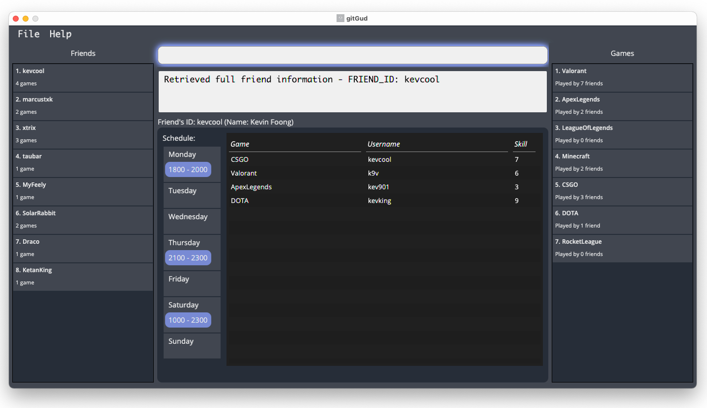

## What is gitGud?

gitGud is a **desktop application for storing and managing your friends' gaming information and schedules**.
It is dedicated to gamers like you and provides a gamer-themed experience with a focus on increasing your efficiency through
its typing-based interface.

Previously, keeping track of all of yours friends' gaming information and schedules can be difficult and time-consuming.
However, with gitGud, there is no need to get tilted (frustrated) by this anymore as gitGud provides you with a convenient
platform to manage essential gaming information of your fellow gamer friends.

For example, to get you excited, gitGud supports many time-saving features such as finding friends available to play with
just a single command.

## Product Screenshot(s):

* For the detailed documentation of this project, please visit the **[gitGud Product Website](https://ay2122s1-cs2103t-w13-4.github.io/tp/)**.

## Acknowledgements

This project is based on the AddressBook-Level3 project created by the [SE-EDU initiative](https://se-education.org).
