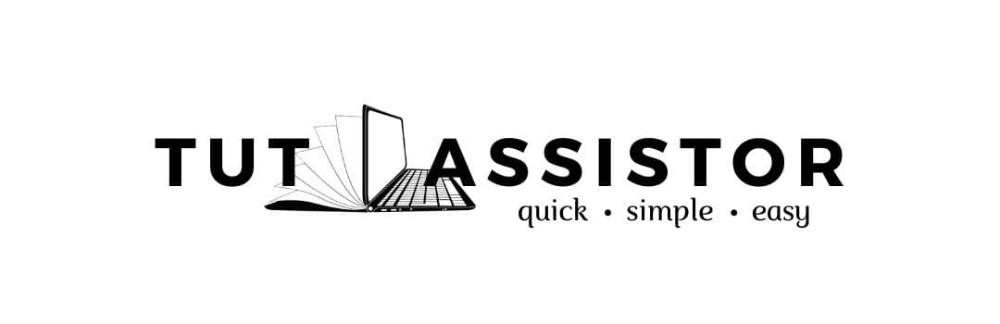

  
  
<h1>Welcome to TutAssistor!</h1>

### Description
TutAssistor is a tool for private tutors to keep track of their students and classes. With TutAssistor, you can manage many different classes and students, and facilitate deconfliction of time slots.

### Features
* Add and edit student contact information.
* Create classes with fixed timeslots and student limit to prevent overbooking.
* Add Tags to students and classes for easier searching.
* Add and edit Notes for students and classes to keep track of miscellaneous information.
* Search and filter students by timeslot, subject, day, etc.
*	Add/view/change time slots for students.
* Be informed of whether or not time slots are fully booked.

### Project information
* This project was made as part of a student project for NUS CS2103T AY21/22 S1.
* For the detailed documentation of this project, see the **[TutAssistor Website](https://ay2122s1-cs2103t-t12-4.github.io/tp/)**.

### Acknowledgements
* This project is based on the AddressBook-Level3 project created by the [SE-EDU initiative](https://se-education.org).
