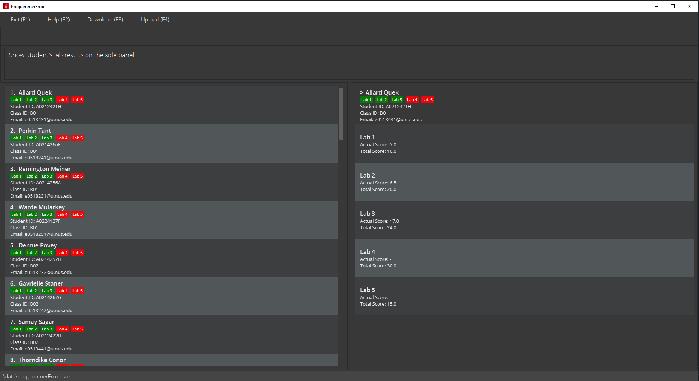

* ProgrammerError (P|E in short) is an application developed based on the `AddressBook Level 3` application.
* This is an application made for CS2100 Teaching Assistants (TAs) to track their students' task progress and performance

## Feature List

1. View Sample Data (shown on starting the application)
2. Purge Sample Data (Delete all)
    - Purge Existing Sample Data
    - `purge`
3. In-build help feature
    - `help`
4. Unix Command Syntax
    - allow user to use flags to execute operations
    - e.g. `add -n <NAME> -sid <STUDENT_ID>`
5. Create records of individual students
    - Name, Student ID, Class ID, Email as a placeholder for default
    - `add -n <NAME> -sid <STUDENT_ID> -cid <CLASS_ID> -email <EMAIL>`
6. Add Lab records with Lab number and total score for all students
   - allow user to create new Lab report instances with a Lab number and total score for that lab report. 
   - `addlab -t 1 -ts 20`
7. Filters the records of individual students using query parameters
    - Filters the list of students based on any combination of the following parameters: Name, Student ID, Class ID, Email
    - `filter -cid <CLASS_ID>`
8. Edit a student's record
    - Edit a student's details at a particular given index off the list
    - Details that can be edited include Name Student ID, Class ID, Email, Lab scores
    - `edit <INDEX> -cid <NEW CLASS_ID>`
10. Delete a student's record
     - Delete the entry of the entire student based on a given index off the list
     - `delete <INDEX>`
11. Automatically Sorted Class Records
     - List will always display the students in a sorted order
     - Sorting key(s): Class ID then Student's Name
12. Save data to Hard Disk
    - Save whenever there is a change (create/edit/delete)

This project is based on the AddressBook-Level3 project created by the [SE-EDU initiative](https://se-education.org).
