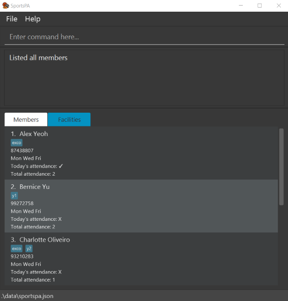

# 🧑‍🏫 Tutor Master

TutorMaster is a desktop app for freelance tutors to manage their students’ grades, assignment submission and tuition fee payment. It is optimised for use via a Command Line Interface (CLI) while still benefiting from a Graphical User Interface (GUI).

## Features
- Handle Students
  - Add
  - Edit
  - View
  - Delete
  - Group
- Handle Tasks
  - Add
  - Edit
  - Delete
  - Assign to Student
  
### Acknowledgement
* This project is based on the AddressBook-Level3 project created by the [SE-EDU initiative](https://se-education.org).
