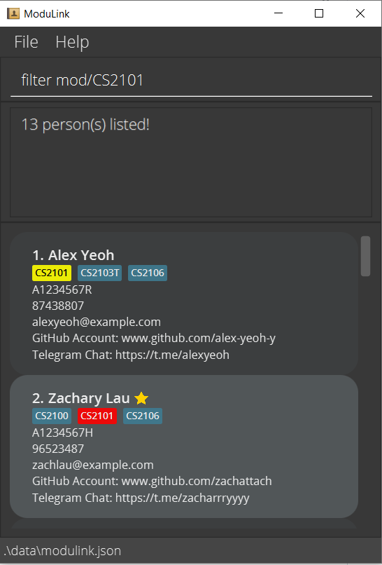

# ModuLink

### The **best** module partner finder for CS students.

#### Overview
- [X] Text based CLI commands - for the fast coders
- [X] Simple - learn in seconds
- [X] Fastest - 0 ping

> Better than Tinder! - SoC CS students

#### Features
1. Create and edit your own profile
2. Add and remove as favourite
3. Find by name
4. Filter by module
5. Filter by grouping status
6. And many more!

For a more detailed documentation of this project, please visit our [Product Website](https://ay2122s1-cs2103t-w12-4.github.io/tp/UserGuide)!

#### Ui Mockup for ModuLink

