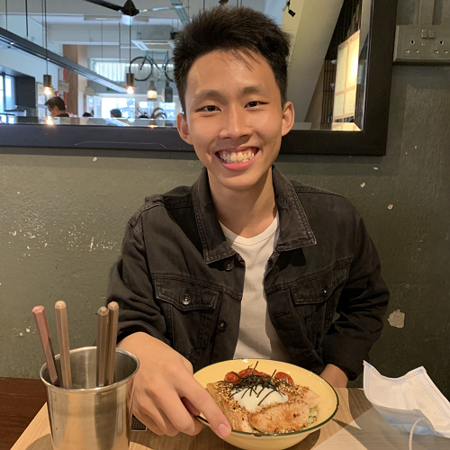

We believe in providing **simplicity** in everything we do here. If you're the kind of person who likes to organize your
communication-based data easily with just a keyboard, you will enjoy UNIon. By re-purposing Unix commands, we ensure
that you can get up to speed quickly and be productive with your data.

# Our Team

## Lee Hur Sebastian

### Role: Team Lead

  
 &nbsp;

## Lye Wen Jun

### Role: Code Quality

  
 &nbsp;

## Lee Wei, David

### Role: Documentation

  
 &nbsp;

## Rehman Sajid

### Role: Integration

  
 &nbsp;

## Ching Jia Rong

### Role: Testing

  
 &nbsp;

