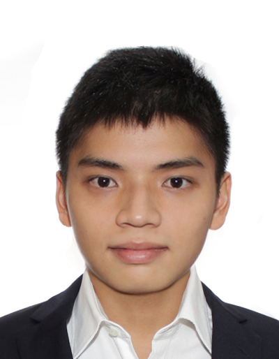
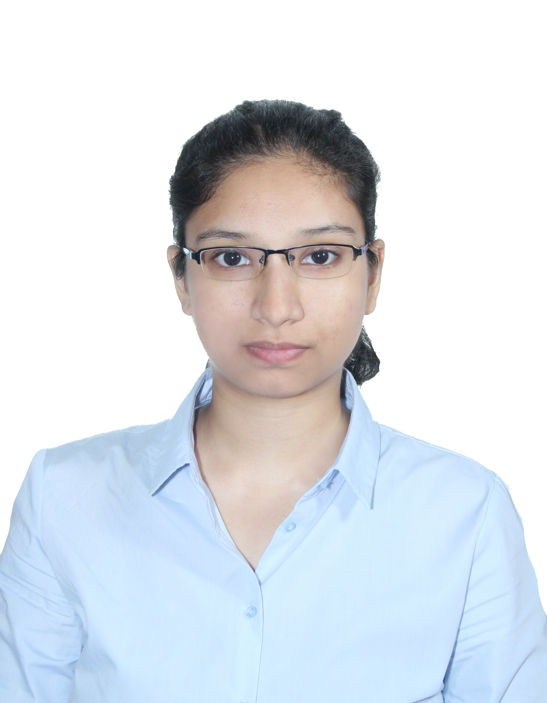
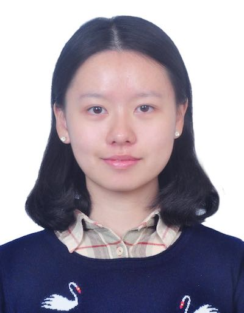
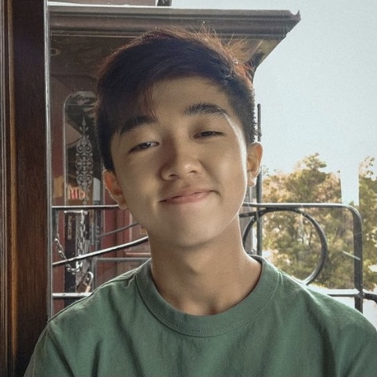

We are a team based in the [School of Computing, National University of Singapore](http://www.comp.nus.edu.sg). This project team was formed for the module CS2103T in AY21/22 Sem 1.

## Project team

### Timothy Ng

[[github](https://github.com/timiditi)]

* Role: Team Lead
* Responsibilities: Documentation

### Mohamed Ammar Zumana Haseen

[[github](http://github.com/amzhy)]
[[portfolio](team/amzhy.md)]

* Role: Developer
* Responsibilities: Ensures the testing of the project is done properly on time

### Deng Huaiyu

[[github](https://github.com/NoraYUuu)]
[[portfolio](team/huaiyu.md)]

* Role: Code Quality
* Responsibilities: Looks after code quality and ensures adherence to coding standards.

### Adam Ho

[[github](http://github.com/adam-ky)]

* Role: Time Keeper
* Responsibilities: In charge of defining, assigning, and tracking project tasks. Ensure project deliverables are done on time.

### Feng Zhunyi

[[github](http://github.com/Leofeng10)]
[[portfolio](team/leofeng10.md)]

* Role: Developer
* Responsibilities: Integration
