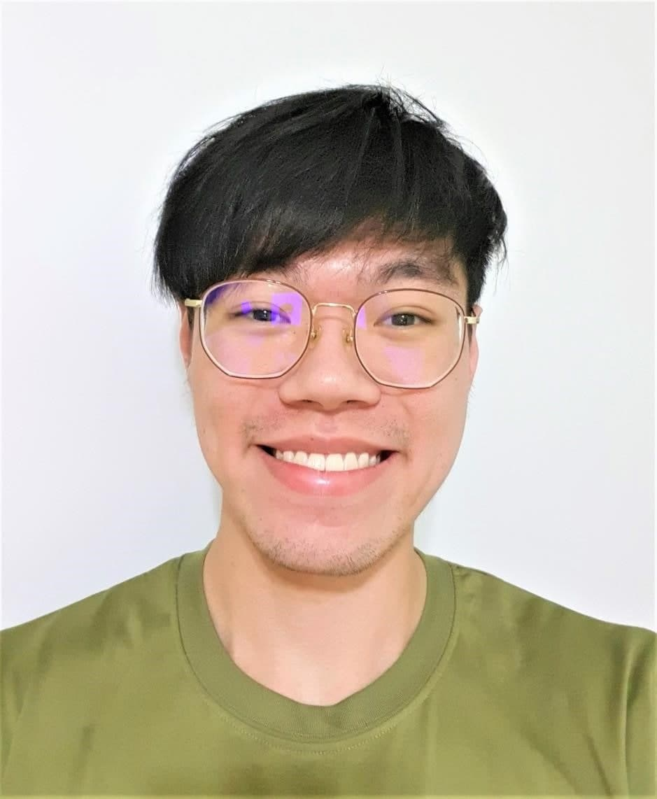
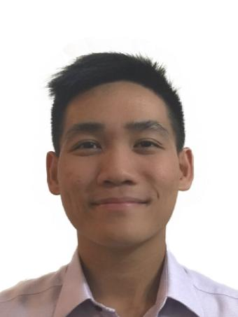
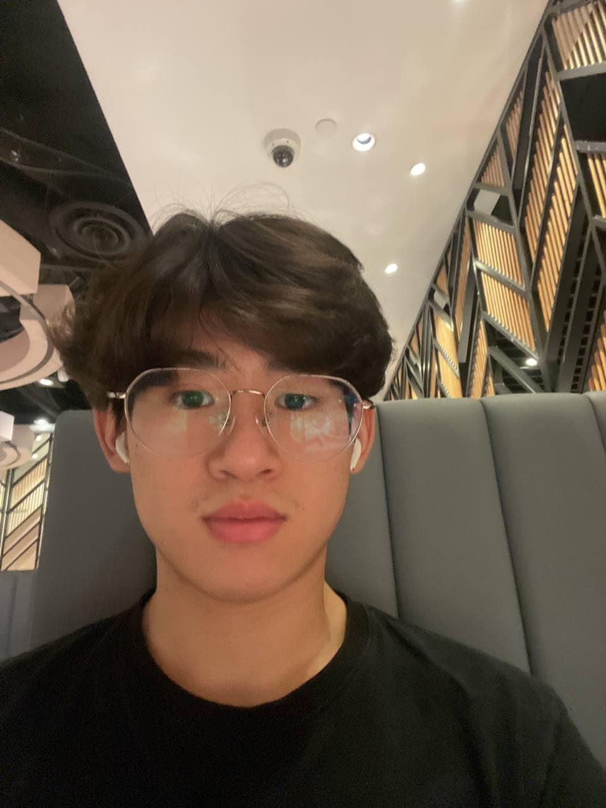
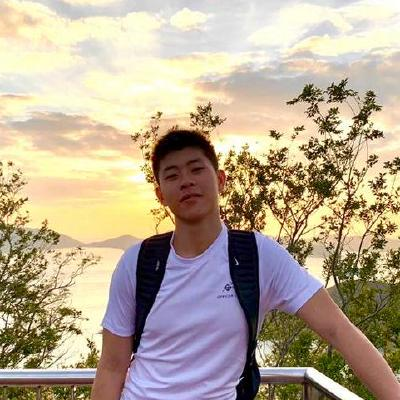
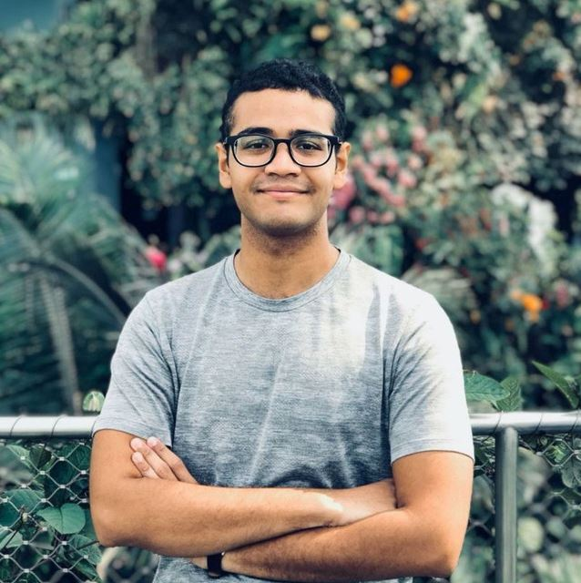

We are a team based in the [School of Computing, National University of Singapore](http://www.comp.nus.edu.sg).

You can reach us at the team lead (Justin)'s email `e0564825@u.nus.edu`.
Here is our module coordinator's
[[homepage](http://www.comp.nus.edu.sg/~damithch)].

## Project Team

### Justin Ee

[[github](https://github.com/eezj35)]
[[portfolio](team/eezj35.md)]

* Role: Team Lead
* Responsibilities: Deliverables and deadlines, Integration

### Michael Lee

[[github](http://github.com/michael-lee-sk)]
[[portfolio](team/michael-lee-sk.md)]

* Role: Developer
* Responsibilities: Testing, Intellij expert

### Rickie Li

[[github](http://github.com/mgrl2201)]
[[portfolio](team/mgrl2201.md)]

* Role: Developer
* Responsibilities: Code quality, Documentation

### Shiyuan Yang

[[github](http://github.com/timothyoung97)]
[[portfolio](team/timothyoung97.md)]

* Role: Developer
* Responsibilities: Data, UI

### Muhammad Khair

[[github](http://github.com/muhammad-khair)]
[[portfolio](team/muhammad-khair.md)]

* Role: Developer
* Responsibilities: Dev Ops, Git expert
