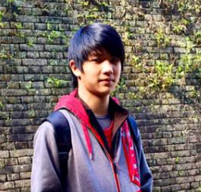
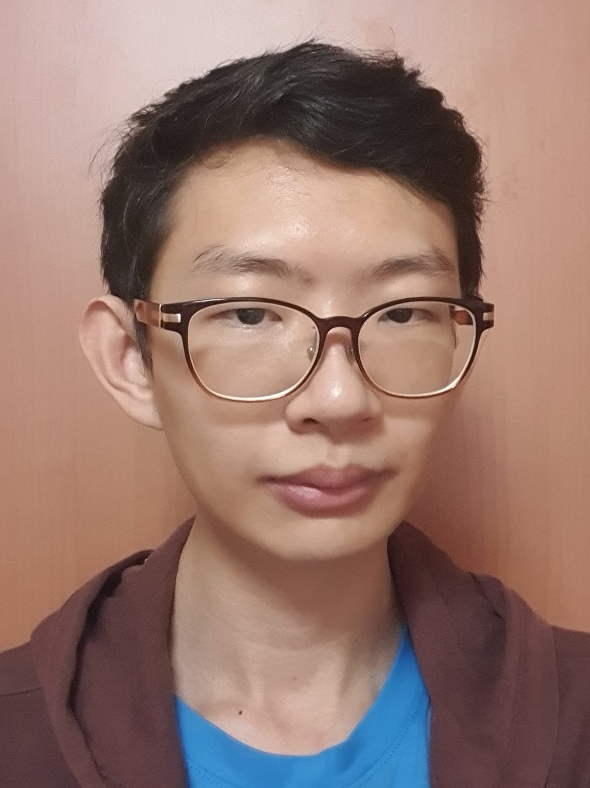
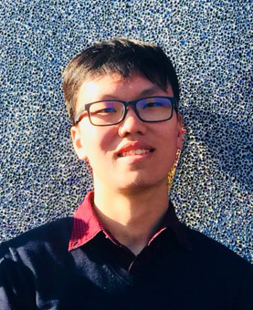
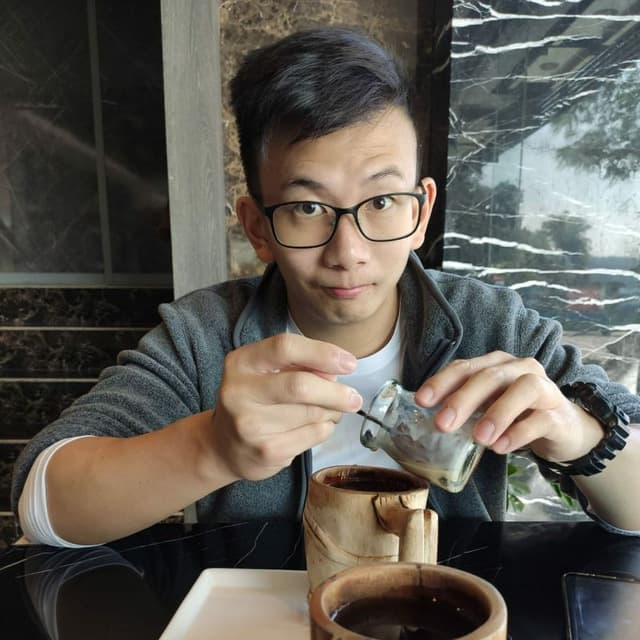

We are a team based in the [School of Computing, National University of Singapore](http://www.comp.nus.edu.sg).  

You may reach us through the following email addresses:
* Khor Ethan: e0526005@u.nus.edu
* Lau Teng Hon: e0543465@u.nus.edu
* Toh Wang Bin: e0544223@u.nus.edu
* Lim Peiyuan: e0543756@u.nus.edu
* Calvin Tan: calvin.twx@u.nus.edu

## Project team

### Khor Ethan

[[github](https://github.com/squeakysquak)]
[[portfolio](team/squeakysquak.md)]

* Role: Developer, in charge of Scheduling & Tracking
* Responsibilities: Model 

### Lau Teng Hon

[[github](https://github.com/Th-429B)]
[[portfolio](team/th-429b.md)]

* Role: Team Lead, in charge of Deliverables & Deadlines
* Responsibilities: Storage

### Toh Wang Bin

[[github](https://github.com/trash-bin99)]
[[portfolio](team/trash-bin99.md)]

* Role: Developer, in charge of Testing
* Responsibilities: Parser

### Lim Peiyuan

[[github](https://github.com/Py0000)]
[[portfolio](team/py0000.md)]

* Role: Developer, in charge of Code Quality
* Responsibilities: Logic

### Calvin Tan

[[github](https://github.com/Cyn7hius)]
[[portfolio](team/cyn7hius.md)]

* Role: Developer, in charge of Documentation
* Responsibilities: UI
