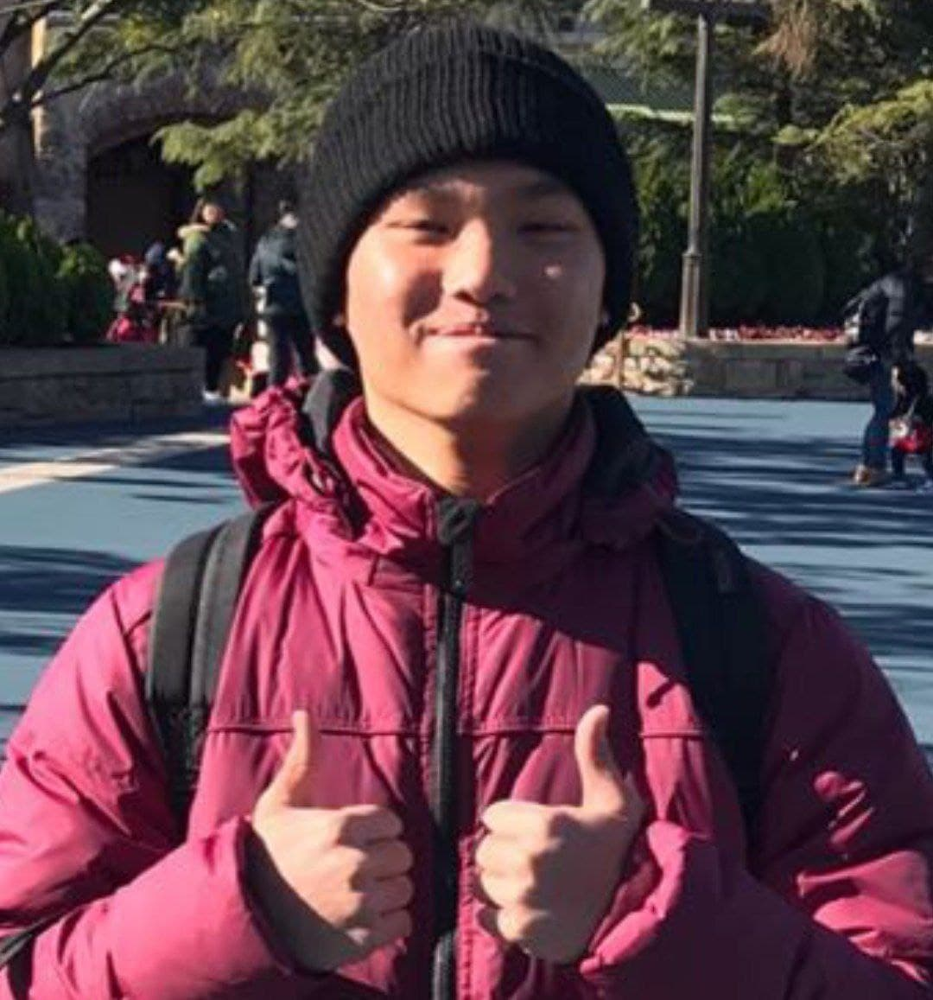

We are a team based in the [School of Computing, National University of Singapore](http://www.comp.nus.edu.sg).

You can reach us at the email `seer[at]comp.nus.edu.sg`

## Project team

### Jonas Chow

[[github](https://github.com/jonas-chow)]

* Role: Team Lead
* Responsibilities: Testing + Scheduling and tracking

### Tang Zhiying

[[github](https://github.com/zhing22)] 
[[portfolio](team/johndoe.md)]

* Role: Developer
* Responsibilities: Documentation + Code quality

### Gan Hong Yao

[[github](https://github.com/ganhongyao)] [[portfolio](team/johndoe.md)]

* Role: Developer
* Responsibilities: Testing + Integration

### Nguyen Ba Van Nhi

[[github](http://github.com/nbvannhi)] [[portfolio](team/johndoe.md)]

* Role: Developer
* Responsibilities: Documentation + Code quality

### Leong Hong Fai

[[github](http://github.com/leonghongfai)]
[[portfolio](team/johndoe.md)]

* Role: Developer
* Responsibilities: Integration + Deliverables and Deadlines
