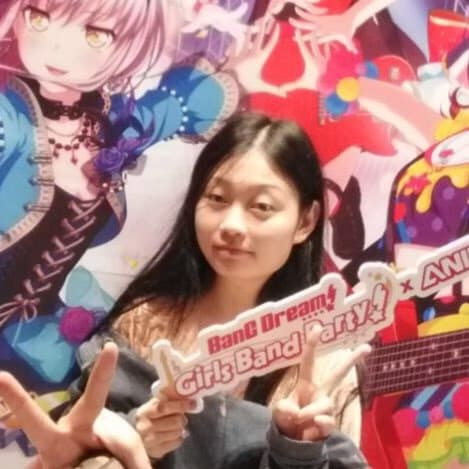

We are a team based in the [School of Computing, National University of Singapore](http://www.comp.nus.edu.sg).

You can reach us at the email `AniList@comp.nus.edu.sg`

## Project team

### Cui Langyuan

[[homepage](http://www.comp.nus.edu.sg/~damithch)]
[[github](https://github.com/clyveycui)]
[[portfolio](team/profile-picture/langyuan.md)]

* Role: Team Lead
* Responsibilities: Overall project coordination

### Chua Min Hong

[[github](https://github.com/auhc99)]
[[portfolio](team/minhong.md)]

* Role: Code Quality
* Responsibilities: Looks after code quality, ensures adherence to coding standards

### Ryan Chung Yi Sheng

[[github](https://github.com/NekrozQliphort)] [[portfolio](team/johndoe.md)]

* Role: Documentation
* Responsibilities: Ensuring quality of vartious project documents

### Luo Dan

[[github](http://github.com/luodan01)]
[[portfolio](team/luodan.md)]

* Role: Integration
* Responsibilities: Versioning the code, maintaining the code repository

### Muhammad Faruq

[[github](http://github.com/muhammad-faruq)]
[[portfolio](team/faruq.md)]

* Role: Scheduling and tracking
* Responsibilities: Defining, assigning, and tracking project tasks
