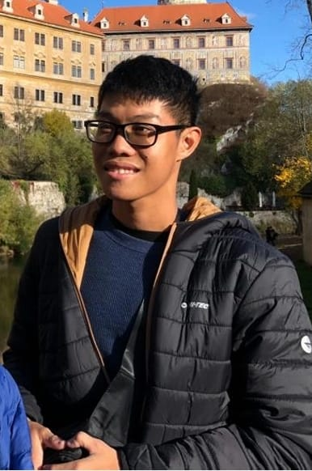
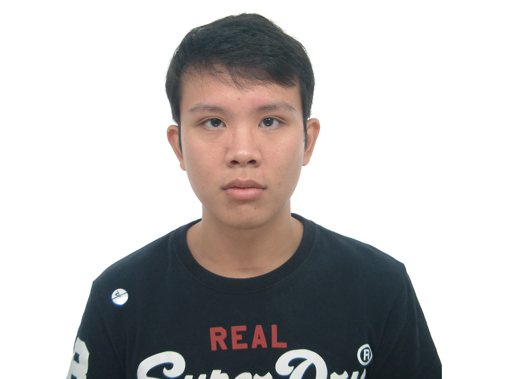
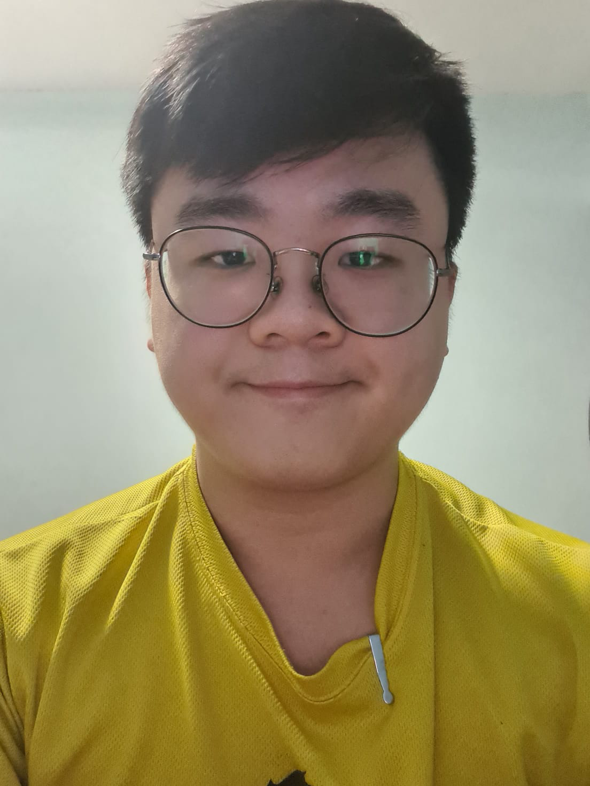

We are a team based in the [School of Computing, National University of Singapore](http://www.comp.nus.edu.sg).

## Project team

### Ajjagottu Kaushik Kumar Reddy

[[github](https://github.com/kaushikkrdy)]

Email: kaushikumar99@gmail.com

* Role: Developer

### Bryann Yeap Kok Keong

[[github](https://github.com/BryannYeap)]

Email: bryannyeapkk@gmail.com

* Role: Developer

### Liu Chen En

[[github](https://github.com/twothicc)]

Email: chenenliuu@gmail.com

* Role: Developer

### Toh Wei Jie

[[github](https://github.com/TohWeiJie01)]

Email: tohweijie01@gmail.com

* Role: Developer

### Yao Yi

[[github](https://github.com/Pulpy-y)]

Email: yaoyi2000326@gmail.com

* Role: Developer
