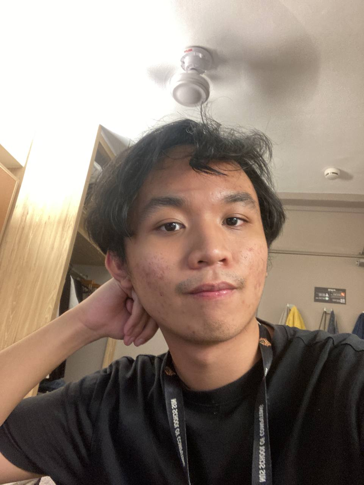
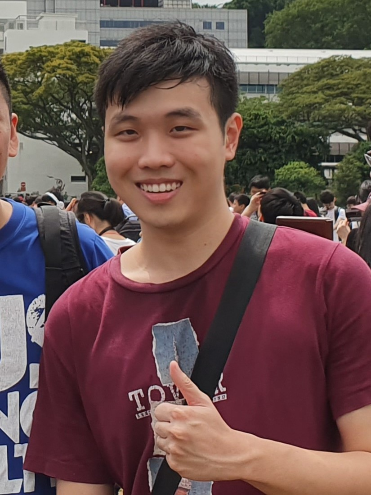
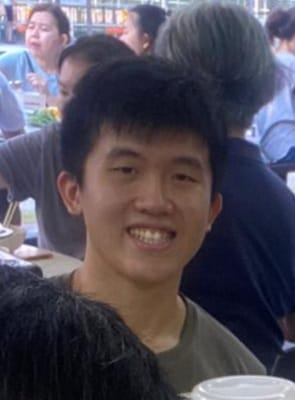
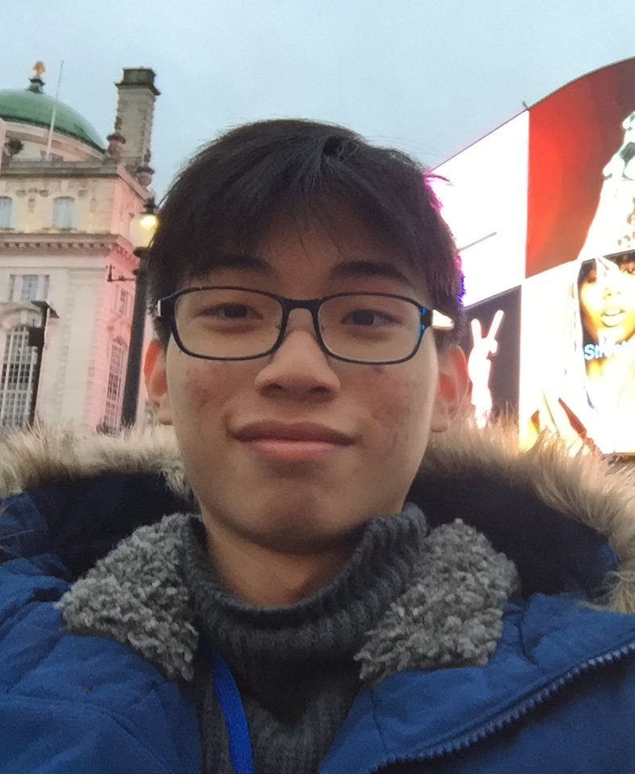
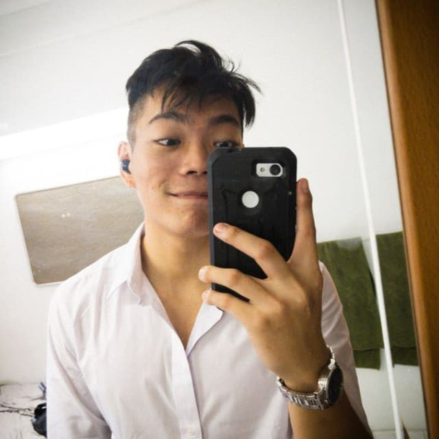

We are a team based in the [School of Computing, National University of Singapore](http://www.comp.nus.edu.sg).

You can reach us at the email `seer[at]comp.nus.edu.sg`

## Project team

### Kan Jitpakdi

[[github](https://github.com/kanjitp)]
[[portfolio](team/kanjitp.md)]

* Role: Project Advisor
* Responsibilities: Full Stack

### Low Kang Ngee

[[github](http://github.com/lowkangn)]
[[portfolio](team/lowkangn.md)]

- Role: Developer
- Responsibilities: Testing + Deliverables and deadlines

### Ye Xinjian

[[github](http://github.com/XXJJXJ)] [[portfolio](team/xxjjxj.md)]

* Role: Developer
* Responsibilities: Documentation + Code Quality

### Ng Tze Wei Bruce Mitchell

[[github](http://github.com/ntwbruce)]
[[portfolio](team/ntwbruce.md)]

- Role: Developer
- Responsibilities: Dev Ops + Threading

### Dave Low

[[github](http://github.com/davelowqx)]
[[portfolio](team/davelowqx.md)]

- Role: Developer
- Responsibilities: Documentation
