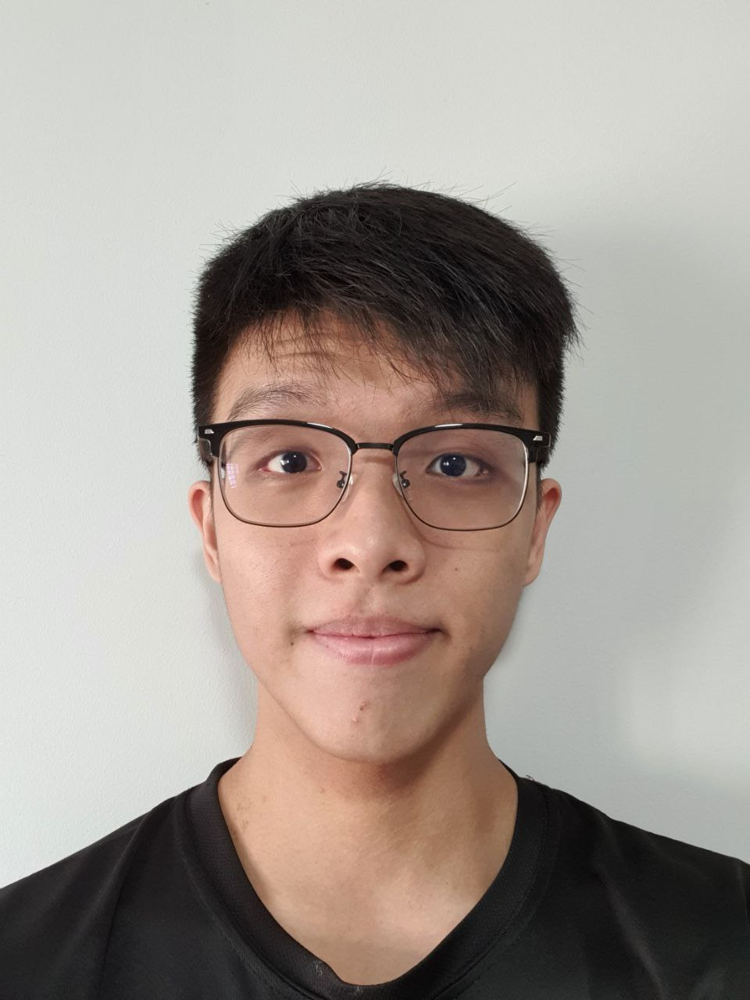
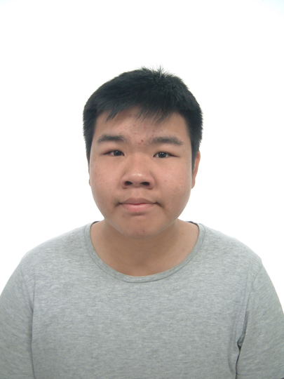
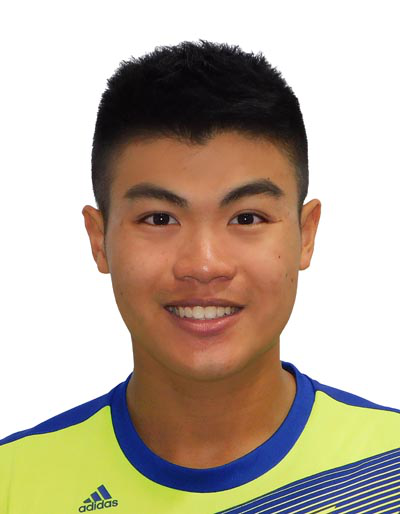

We are a team based in the [School of Computing, National University of Singapore](http://www.comp.nus.edu.sg).

You can reach us at the email `e0540149@u.nus.edu`

## Project team

### Lim Wei Jie

[[github](https://github.com/lwj1711)]
[[portfolio](team/lwj1711.md)]

* Role: Developer
* Responsibilities: Delete feature + Testing

### Kelvin Soo

[[github](http://github.com/KelvinSoo)]
[[portfolio](team/KelvinSoo.md)]

* Role: Developer
* Responsibilities: Find feature + Javadocs

### Hardik Narang

[[github](http://github.com/naranghardik16)]
[[portfolio](team/naranghardik16.md)]

* Role: Developer
* Responsibilities: Priority Feature + UI/UX

### Sourabh Jaiswal

[[github](http://github.com/srj31)]
[[portfolio](team/srj31.md)]

* Role: Developer
* Responsibilities: Add Feature + Algorithm

### Loo Wee Sing Caspian Michael

[[github](http://github.com/dr-octavius)]
[[portfolio](team/Dr-Octavius.md)]

* Role: Developer
* Responsibilities: Show Feature + Code Logic
