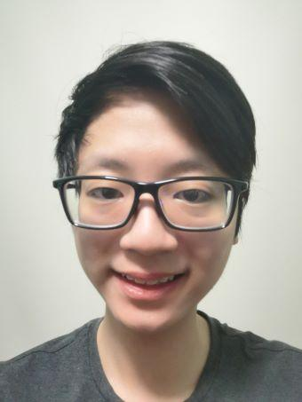
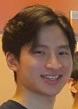
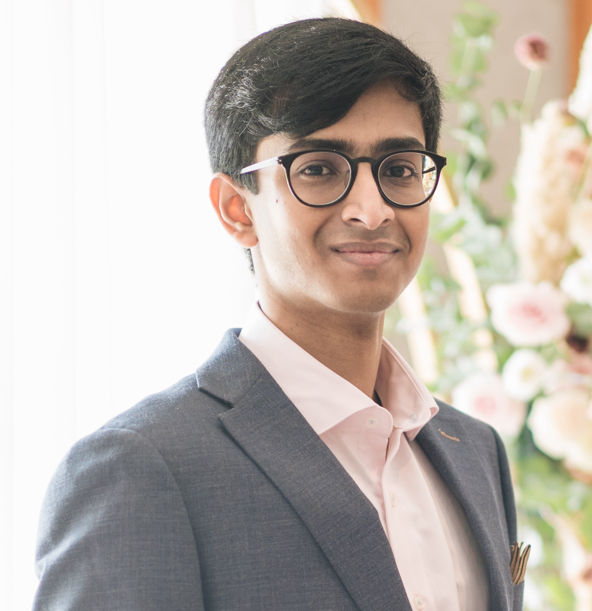
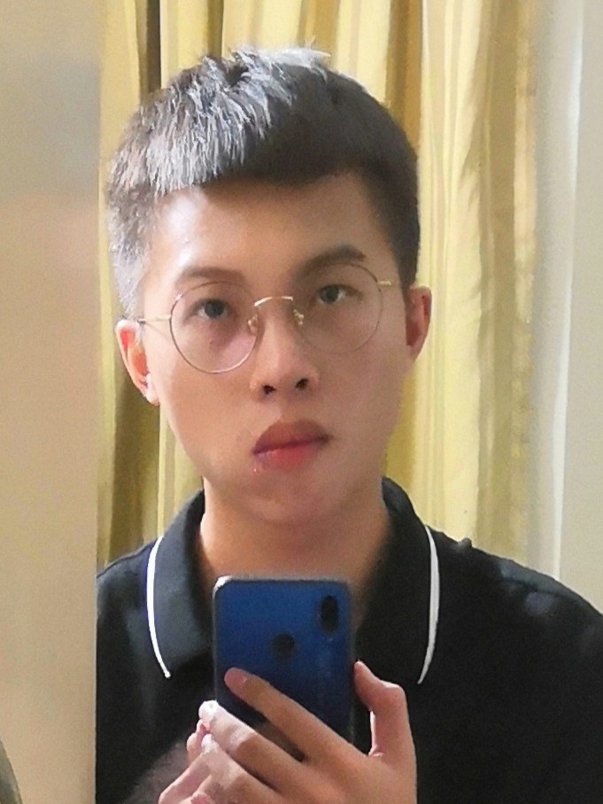
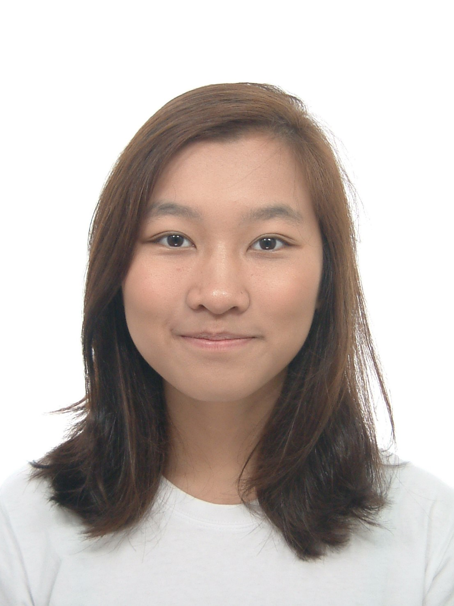

We are a team based in the [School of Computing, National University of Singapore](http://www.comp.nus.edu.sg).

## Project team

### Gabriel Au

[[github](http://github.com/Gabau)]
[[portfolio](team/gabau.md)]

* Role: Developer
* Responsibilities: UI, Code Quality, Testing and Integration

### Jonathan Tan

[[github](http://github.com/fullfatwasabi)]
[[portfolio](team/fullfatwasabi.md)]

* Role: Developer
* Responsibilities: Tool, Documentation, Scheduling and tracking

### Sreenivasa Kalpana Surya

[[github](http://github.com/tetrerox)]
[[portfolio](team/tetrerox.md)]

* Role: Developer
* Responsibilities: Integration, Code Quality and Documentation

### He Outong

[[github](http://github.com/IrvingHe000)]
[[portfolio](team/irvinghe000.md)]

* Role: Developer
* Responsibilities: Testing, Integration, Tool expert

### Megan Wee Rui En

[[github](http://github.com/mweeruien)][[portfolio](team/mweeruien.md)]

* Role: Developer
* Responsibilities: Team Lead, Deliverables and deadlines, and Assistant GUI Expert
