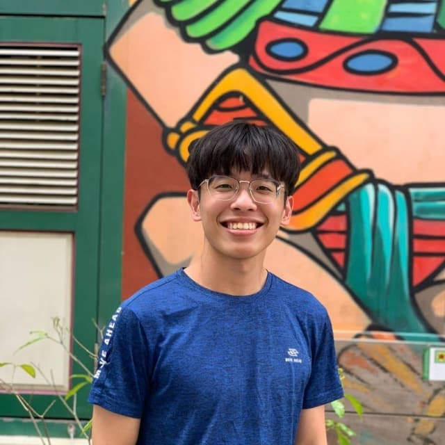
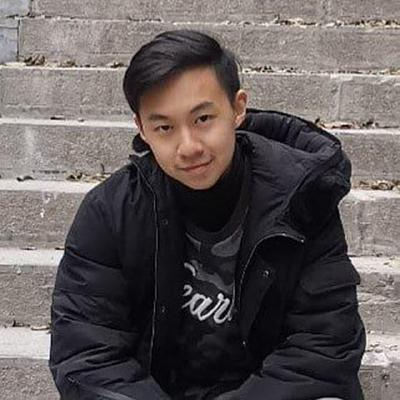
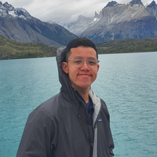
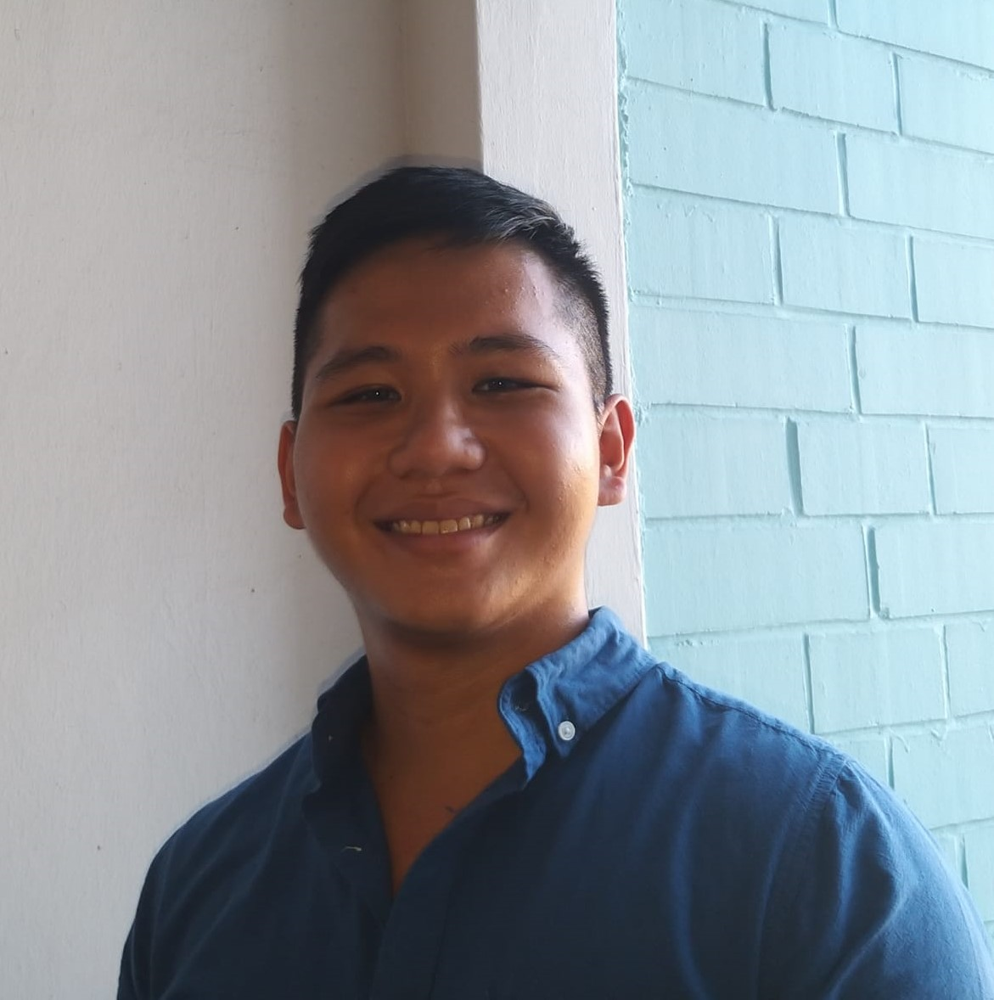

We are a team based in the [School of Computing, National University of Singapore](http://www.comp.nus.edu.sg).

## Project team

### Jia Yi

[[github](https://github.com/jiayi1129)]
[[portfolio](team/jiayi1129.md)]

* Role: Team Lead
* Responsibilities: Responsible for overall project coordination.

### Pua Li Xue

[[github](http://github.com/pualixue)]
[[portfolio](team/pualixue.md)]

* Role: Code Quality
* Responsibilities: Looks after code quality, ensures adherence to coding standards.

### Tey Hao Ze

[[github](https://github.com/haozeee)]
[[portfolio](team/haozeee.md)]

* Role: Scheduling and tracking
* Responsibilities: In charge of defining, assigning and tracking project tasks

### Koh Hong Po

[[github](https://github.com/hpkoh)]
[[portfolio](team/hpkoh.md)]

* Role: Testing
* Responsibilities: Ensures the testing of the project is done properly and on time

### Chuang Zhe Quan

[[github](http://github.com/ChuangZheQuan)]
[[portfolio](team/ChuangZheQuan.md)]

* Role: Documentation
* Responsibilities: Responsible for the quality of various project documents.
