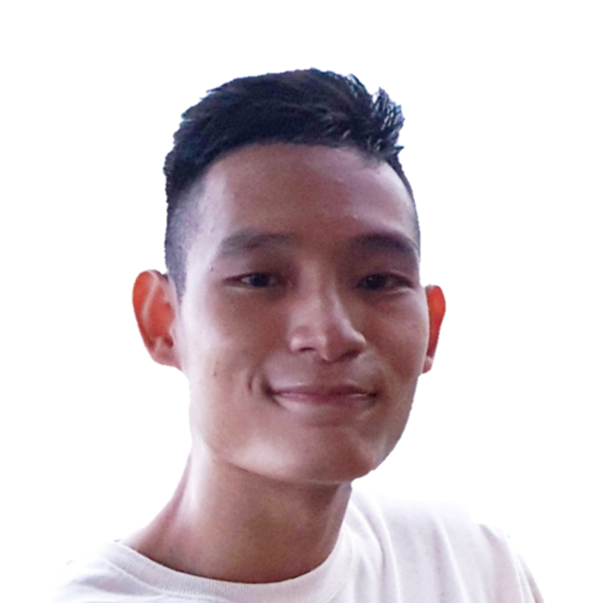
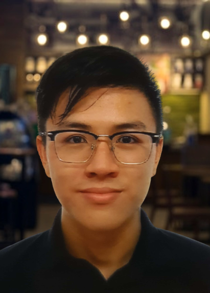
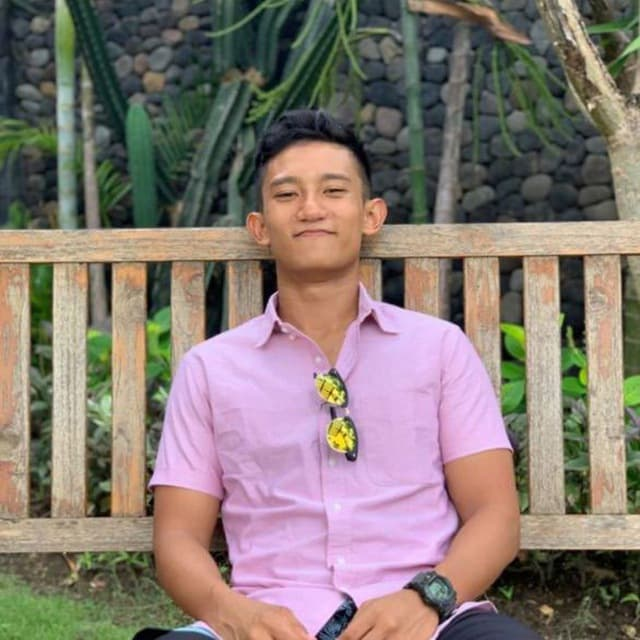
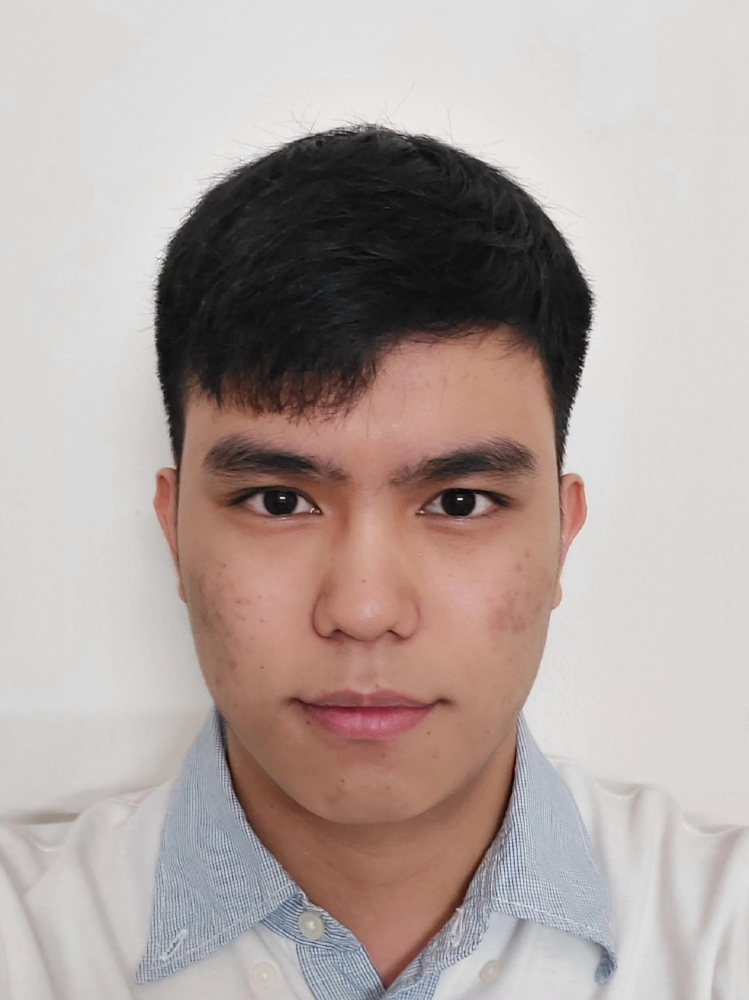
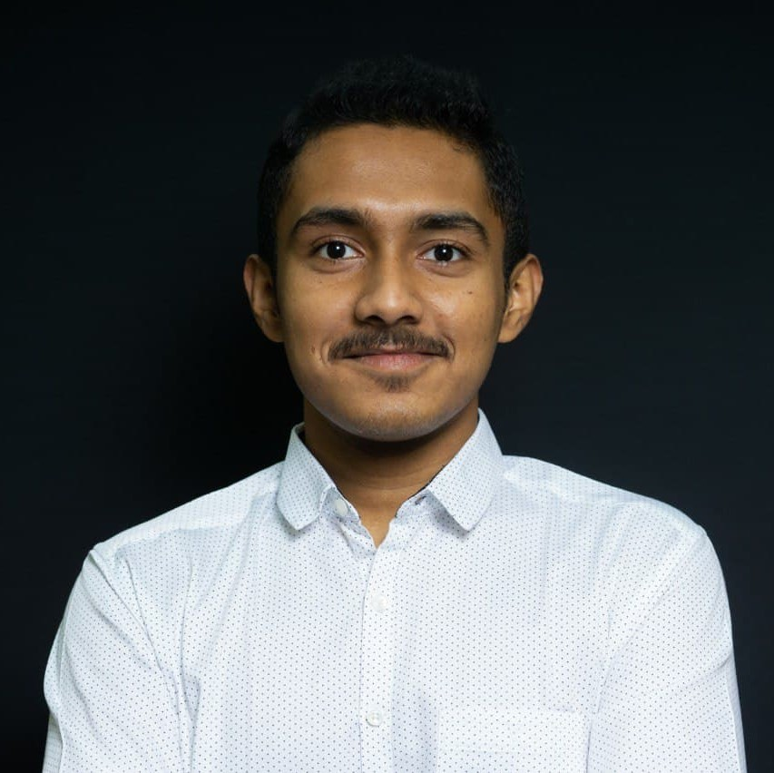

We are a team based in the [School of Computing, National University of Singapore](https://www.comp.nus.edu.sg).

For any inquiries, please reach us at the email `seer[at]comp.nus.edu.sg`

## Project team

### Kevin Foong Wei Tong

[[github](https://github.com/kevin9foong)]
[[portfolio](team/kevin9foong.md)]

* Role: Team Lead, Deadlines & Delivery
* Responsibilities: In charge of the `add`, `edit` and `recommend` features and the Storage component.

### Marcus Tang Xin Kye

[[github](https://github.com/marcustxk)]
[[portfolio](team/marcustxk.md)]

* Role: Integration, Code Quality
* Responsibilities: In charge of `list` feature and schedule feature.

### Taufiq Bin Abdul Rahman

[[github](https://github.com/tau-bar)]
[[portfolio](team/tau-bar.md)]

* Role: Scheduling
* Responsibilities: In charge of `delete` feature and UI.

### Lim Yu Zher

[[github](https://github.com/lzher385)]
[[portfolio](team/lzher385.md)]

* Role: Documentation
* Responsibilities: In charge of `link` feature

### Yeluri Ketan

[[github](https://github.com/YeluriKetan)]
[[portfolio](team/yeluriketan.md)]

* Role: Testing
* Responsibilities: In charge of the `get` feature and the Model component.
