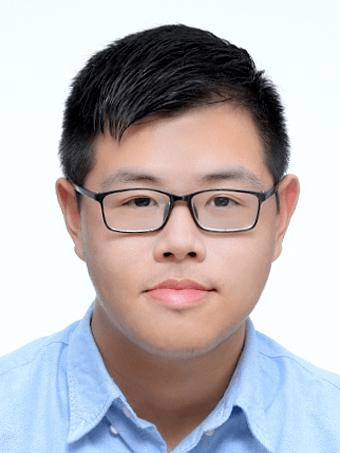
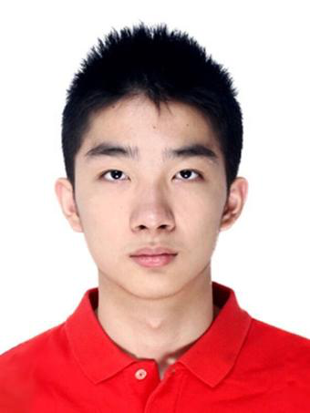
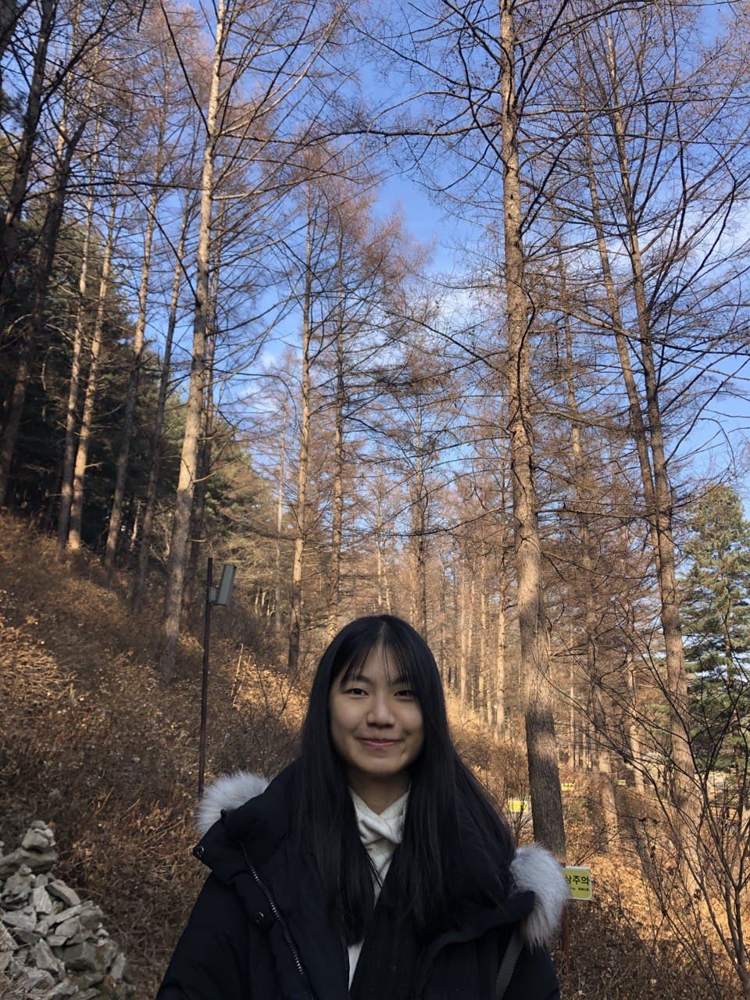
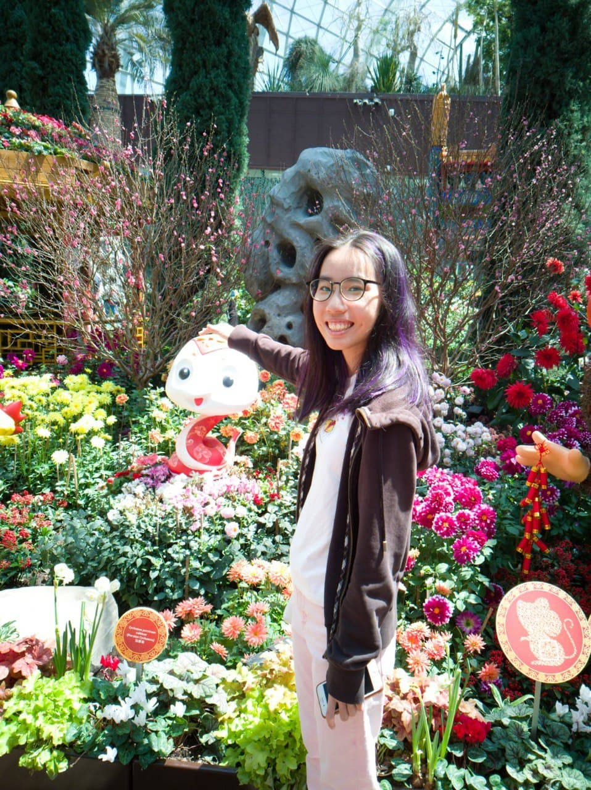
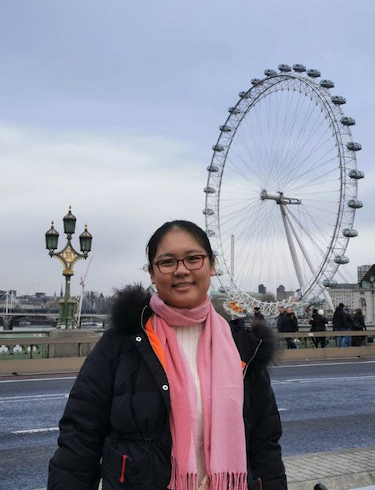

We are a team based in the [School of Computing, National University of Singapore](http://www.comp.nus.edu.sg).

You can reach us through the following email addresses:

- Lua Yi Da `e0543409@u.nus.edu`
- Chen Yiyang `e0563851@u.nus.edu`
- Hong Ai Ling `ailing.hong@u.nus.edu`
- Hu Linglong `e0580032@u.nus.edu`
- Zhang Ziqing `zhangziqing@u.nus.edu`

## Project team

### Lua Yi Da

[[github](http://github.com/luayida99)]
[[portfolio](team/luayida99.md)]

- Role: Team Lead
- Responsibilities: Deliverables and deadlines

### Chen Yiyang

[[github](https://github.com/Chen-Yiyang)]
[[portfolio](team/chen-yiyang.md)]

- Role: Developer
- Responsibilities: Integration

### Hong Ai Ling

[[github](https://github.com/ailing35)]
[[portfolio](team/ailing35.md)]

- Role: Developer
- Responsibilities: Code quality

### Hu Linglong

[[github](http://github.com/huisthat)]
[[portfolio](team/huisthat.md)]

- Role: Developer
- Responsibilities: Documentation

### Zhang Ziqing

[[github](http://github.com/ziqing26)]
[[portfolio](team/ziqing26.md)]

- Role: Developer
- Responsibilities: UI, Documentation, Testing

  Hello I am a CS undergraduate from New College who like playing around with cool stuff, experienced flute player (13 years) and anime lover! Reach out to me via [email](mailto:zhangziqing@u.nus.edu).
