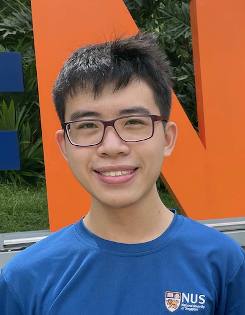
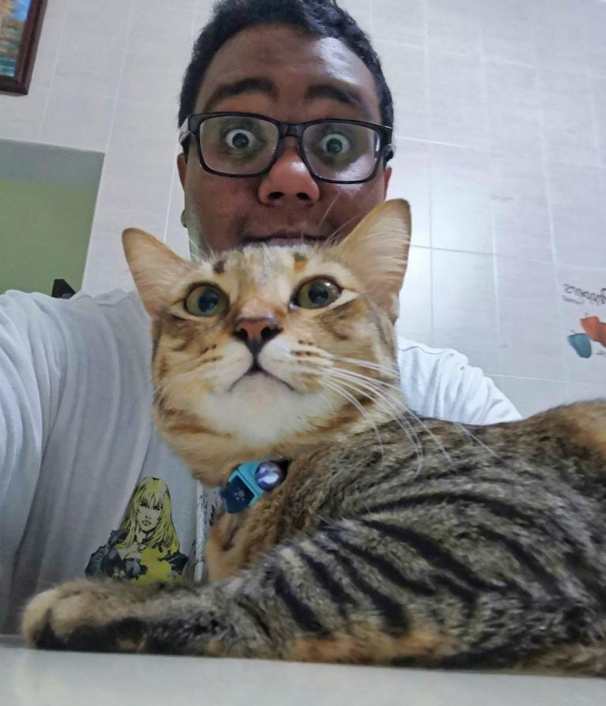
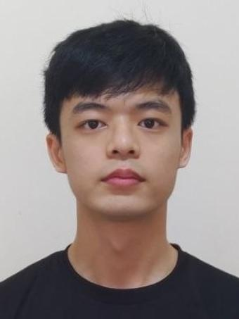
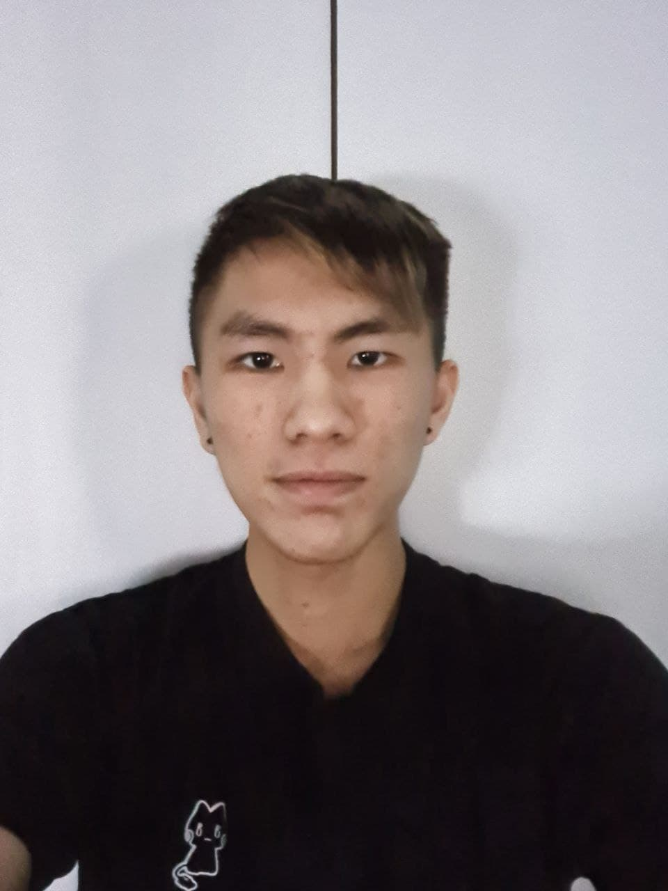

We are a team based in the [School of Computing, National University of Singapore](http://www.comp.nus.edu.sg).

## Project team

### Siew Hui Zhuan

[[homepage](https://huizhuansam.github.io)]
[[github](https://github.com/huizhuansam)]
[[portfolio](team/huizhuansam.md)]

- Role: Scheduling and Tracking, Deliverables and Deadlines
- Responsibilities: User assistance, command syntax

### Kishendran Vendar Kon

[[github](https://github.com/KishendranVendarKon)]
[[portfolio](team/kishendranvendarkon.md)]

- Role: Testing
- Responsibilities: In charge of `Storage` component

### Lee Zheng Han

[[github](https://github.com/zhenghanlee)]
[[portfolio](team/zhenghanlee.md)]

- Role: Documentation, VSCode Expert
- Responsibility: Search by categories

### Loh Xian Ze, Bryan

[[github](https://github.com/anonymxtrix)]
[[portfolio](team/anonymxtrix.md)]

- Role: Code Quality, Git Expert
- Responsibility: Logic

### Zhou Jiahao

[[github](https://github.com/Zhou-Jiahao-1998)]
[[portfolio](team/zhou-jiahao-1998.md)]

- Role: Integration
- Responsibility: Search by categories
