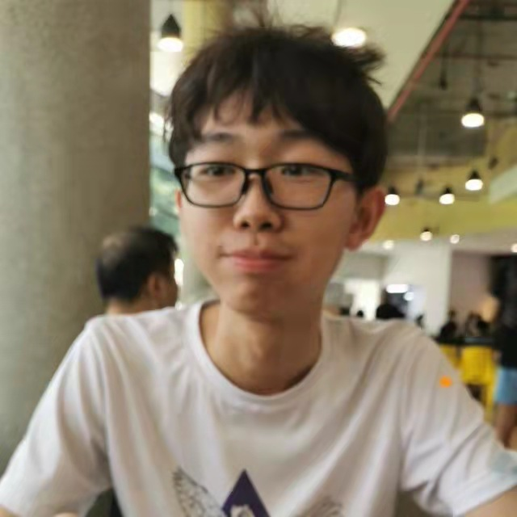
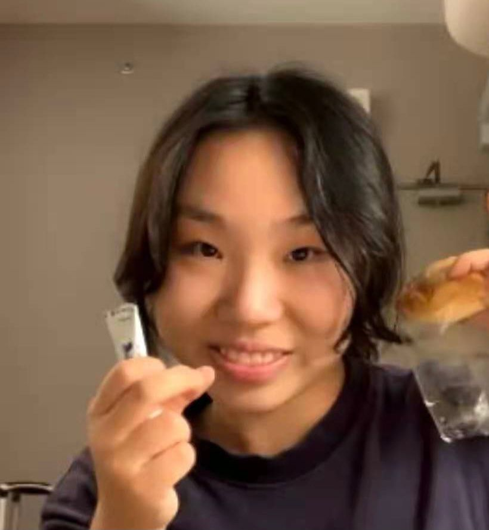
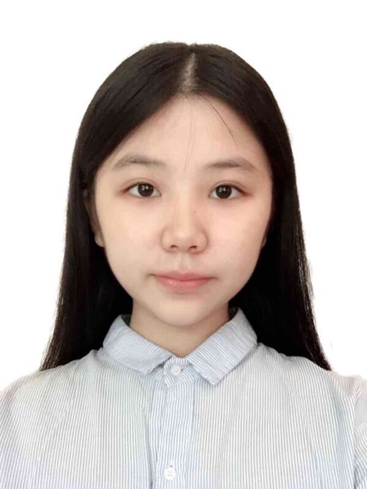

We are a team based in the [School of Computing, National University of Singapore](http://www.comp.nus.edu.sg).

You can reach us at the email `seer[at]comp.nus.edu.sg`

## Project team

### Dillon Tan Kiat Wee

[[homepage](http://www.comp.nus.edu.sg/~damithch)]
[[github](https://github.com/el0hime)]
[[portfolio](team/el0hime.md)]

* Role: Project Advisor

### LUO ZHIJIE

[[github](http://github.com/luozhijie-tom)]
[[portfolio](team/luozhijie-tom.md)]

* Role: Team Lead
* Responsibilities: UI

### Jodi Choo

[[github](http://github.com/jodichoo)] [[portfolio](team/jodichoo.md)]

* Role: Developer
* Responsibilities: Data

### Chen Xiaotong

[[github](http://github.com/WuaaAj)]
[[portfolio](team/johndoe.md)]

* Role: Developer
* Responsibilities: Dev Ops + Threading

### Weng Ying

[[github](http://github.com/wengYing227)]
[[portfolio](team/wengying227.md)]

* Role: Developer
* Responsibilities: UI
