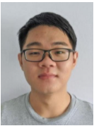
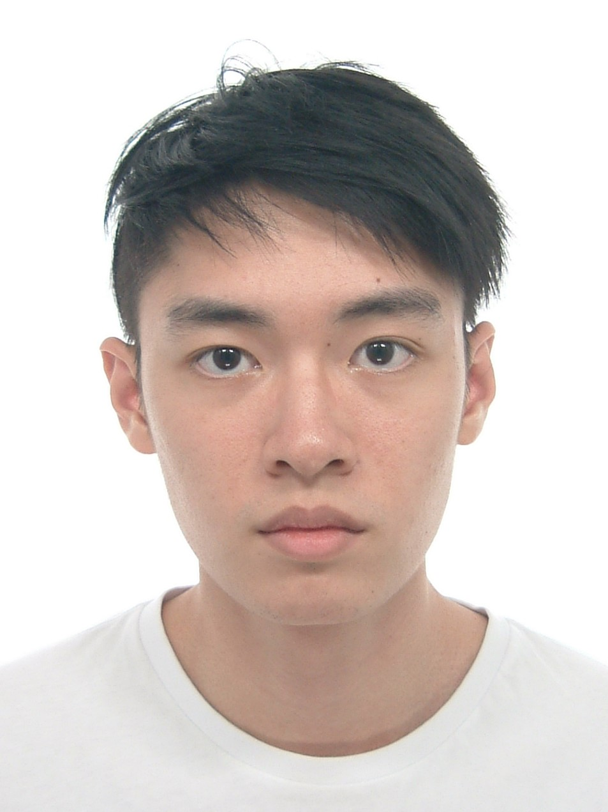
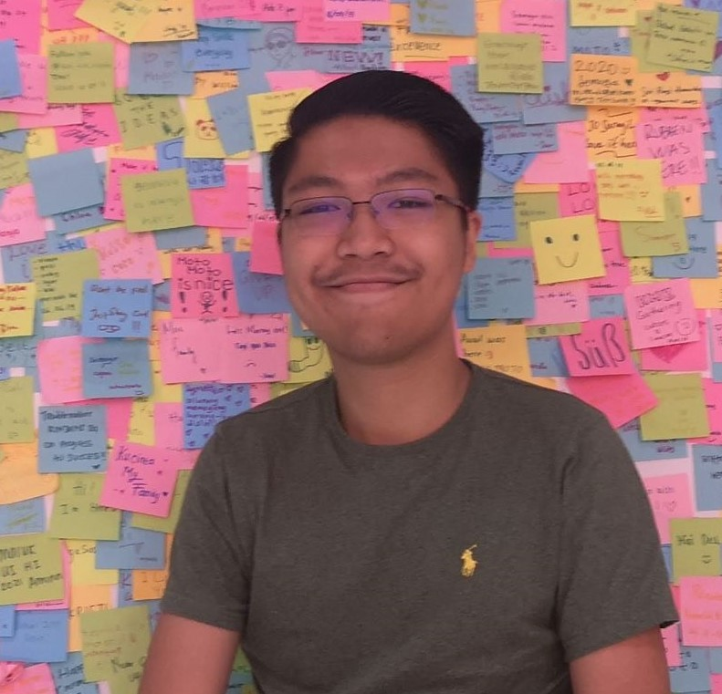
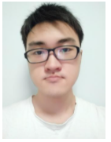

We are a team based in the [School of Computing, National University of Singapore](http://www.comp.nus.edu.sg).

You can reach us at the email `seer[at]comp.nus.edu.sg`

## Project team

### Lim Zhe Kang

[[github](http://github.com/limzk126)]
[[portfolio](team/limzk126.md)]

* Role: Testing
* Responsibilities: Ensure the testing of the project is done properly and on time.

### Chan Sze Ann, Eugene

[[github](http://github.com/eugenecsa)] [[portfolio](team/eugenecsa.md)]

* Role: Code Quality
* Responsibilities: Looks after code quality, ensures adherence to coding standards, etc.

### Ho Wen Zhong

[[github](http://github.com/wz27)]
[[portfolio](team/johndoe.md)]

* Role: Integration, Scheduling and Tracking
* Responsibilities: In charge of versioning of the code, maintaining the code repository, integrating various parts of
  the software to create a whole. In charge of defining, assigning, and tracking project tasks.

### Andrew Baruch

[[github](https://github.com/LeopardMerkava)]
[[portfolio](team/leopardmerkava.md)]

* Role: Deliverable and Deadline, UI
* Responsibilities: Ensure project deliverables are done on time and in the right format. In charge of UI ensuring it fits the use case.

### Lim Kai Fang

[[GitHub page](https://github.com/kflim)]
[Portfolio](team/kflim.md)
* Role: Documentation
* Responsibilities: Responsible for the quality of various project documents.
