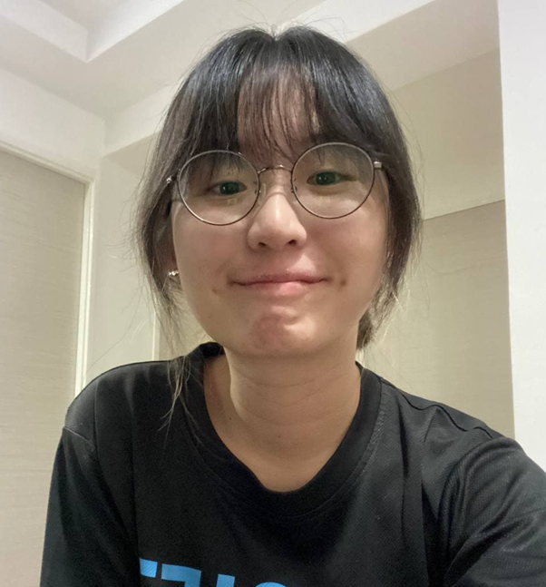
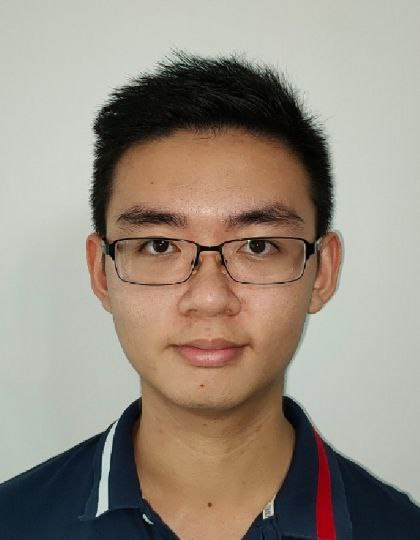
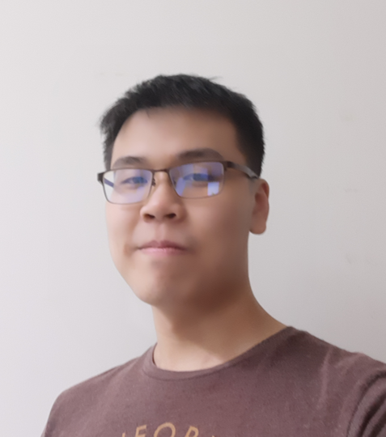
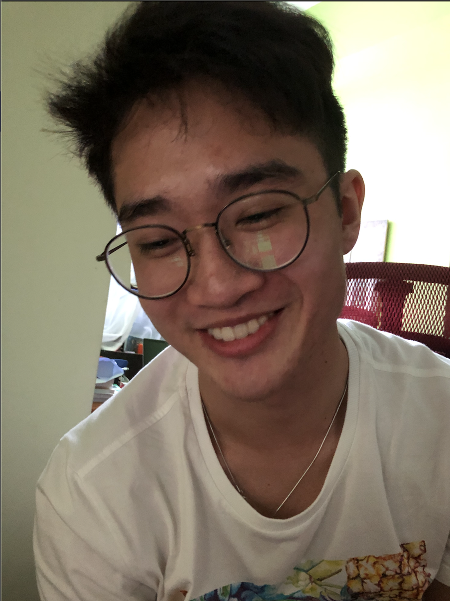
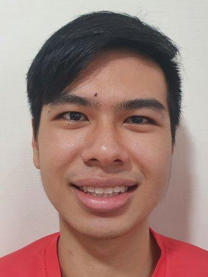

We are a team based in the [School of Computing, National University of Singapore](http://www.comp.nus.edu.sg).

You can reach us at the email `e0559779@u.nus.edu`

## Project team

### Erin Ong

[[github](https://github.com/greyguy21)] 
[[portfolio](team/greyguy21.md)]

* Role: Team Lead
* Responsibilities: UI

### Lim Jun Wei

[[github](https://github.com/junwei26/)] 
[[portfolio](team/junwei26.md)]

* Role: Developer
* Responsibilities: Github expert, Scheduling and Tracking

### Teo Zhi Hao

[[github](https://github.com/Yttruire)] 
[[portfolio](team/yttruire.md)]

* Role: Developer
* Responsibilities: Data management and Integration

### Brian Cheong

[[github](https://github.com/SKCheongBrian)] 
[[portfolio](team/skcheongbrian.md)]

* Role: Developer
* Responsibilities: Testing and documentation

### Tan Jia Xian

[[github](https://github.com/tanjiaxian99)]

* Role: Developer
* Responsibilities: Code Quality
