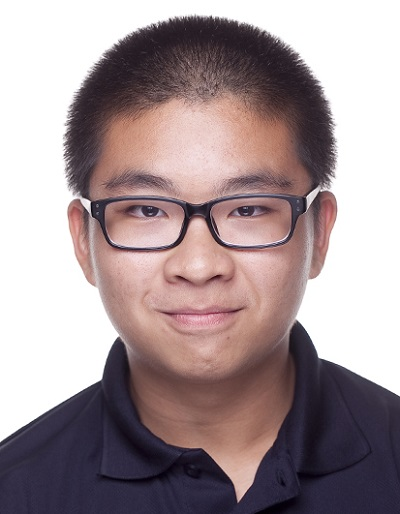
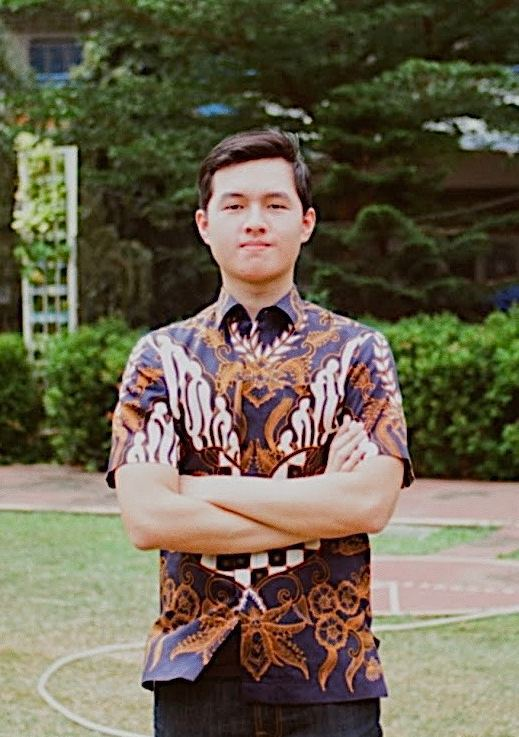

We are a team based in the [School of Computing, National University of Singapore](http://www.comp.nus.edu.sg).

You can reach us at the email `e0559714@u.nus.edu`

## Project team

### Chen Hsiao Ting

[[github](https://github.com/hsiaotingluv)]
[[portfolio](team/hsiaotingluv.md)]

* Role: Team lead
* Responsibilities:
  1. Team lead: Responsible for overall project coordination.
  2. Scheduling and tracking: In charge of defining, assigning, and tracking project tasks.
  3. Deliverables and deadlines: Ensure project deliverables are done on time and in the right format.
  4. Logic package gatekeeper: In charge of merging any commits related Logic package on main repo.

### Chan Choon Yong

[[github](https://github.com/choonyongchan)]
[[portfolio](team/chanchoonyong.md)]

* Role: Developer, Tester, Manager
* Responsibilities:
  1. Quality Assurance (QA) Analyst [Testing]: Ensures the testing of the project is done properly and on time.
  2. Progress Manager: Check weekly tp progress.
  3. Test package gatekeeper: In charge of merging any commits related Test package on main repo.

### Kevin Nathanael Mingtarja

[[github](https://github.com/kevinmingtarja)]
[[portfolio](team/kevinnathanaelmingtarja.md)]

* Role: Developer
* Responsibilities:
  1. Code Quality Assurance (QA) Analyst [Code quality]: Looks after code quality, ensures adherence to coding standards, etc.
  2. Integration: In charge of versioning of the code, maintaining the code repository, integrating various parts of the software to create a whole.
  3. Model package gatekeeper: In charge of merging any commits related to Model package on main repo.

### Lim Boon Kee

[[github](https://github.com/bklimey)]
[[portfolio](team/bklimey.md)]

* Role: Developer, Documenter
* Responsibilities:
  1. Team Documentation (Meeting minutes, planning, brainstorm materials): Responsible for the quality of various team documents.
  2. Storage package gatekeeper: In charge of merging any commits related to Storage package on main repo.

### Nathan Wong Hung Rui

[[github](https://github.com/e0543978)]
[[portfolio](team/nathanwonghungrui.md)]

* Role: Developer, Documenter, Tool Expert
* Responsibilities:
  1. Project Documentation (UG & DG): Responsible for the quality of various project documents.
  2. UI (JavaFX): In-charged of UI direction.
  3. Tool expert: e.g. Intellij expert, Git expert, etc. Helps other team members with matters related to the specific tool.
  4. UI package gatekeeper: In charge of merging any commits related UI package on main repo.
