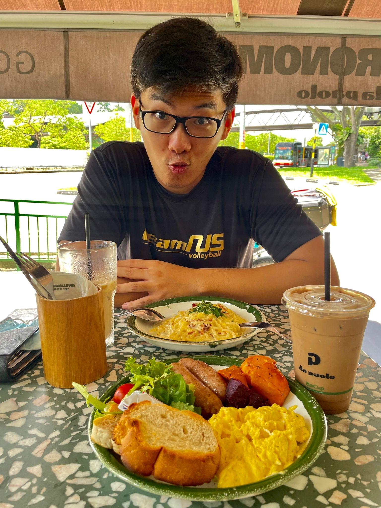

We are a team based in the [School of Computing, National University of Singapore](http://www.comp.nus.edu.sg).

## Project team

### Javier Phon Zhee Kai

[[github](https://github.com/javiier-pzk)]
[[portfolio](team/johndoe.md)]

* Role: Team Lead
* Responsibilities: In charge of deliverables, deadlines, scheduling and tracking

### Low Qi Hong Chetwin

[[github](http://github.com/chetwinlow)]
[[portfolio](team/johndoe.md)]

* Role: Documentation
* Responsibilities: In charge of quality of user guide and developer guide

### Kong Fanji

[[github](http://github.com/clementkfj)] 
[[portfolio](team/johndoe.md)]

* Role: Git and IntelliJ Expert
* Responsibilities: Integration and helping the team with Git issues

### Lee Hern Ping

[[github](http://github.com/hernpiblo)]
[[portfolio](team/johndoe.md)]

* Role: Code quality checker
* Responsibilities: Checks code quality and ensures all team members adhere to coding standards

### Pham Ba Thang

[[github](http://github.com/pbthang)]
[[portfolio](team/johndoe.md)]

* Role: Testing and Debug
* Responsibilities: Ensures testing of code is done properly and on time
