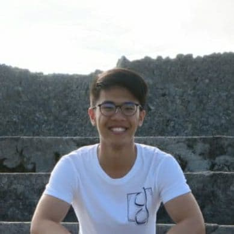
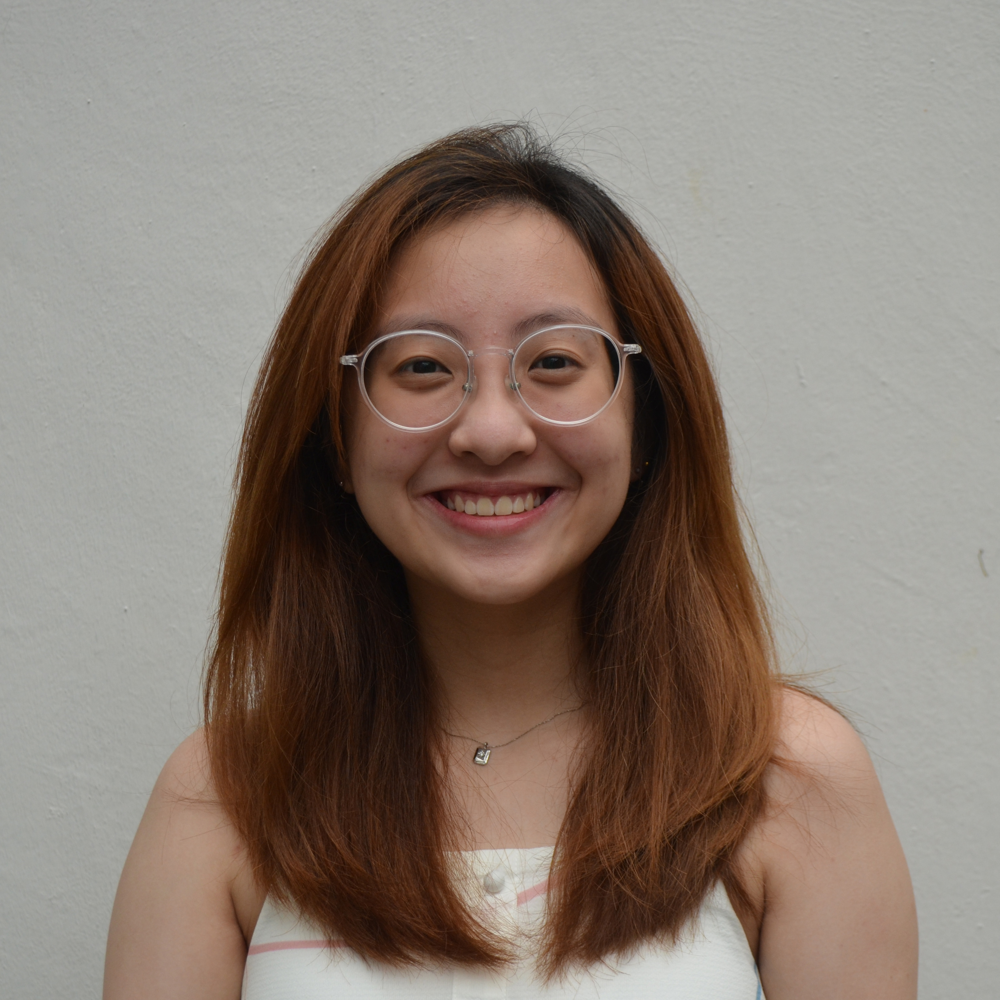
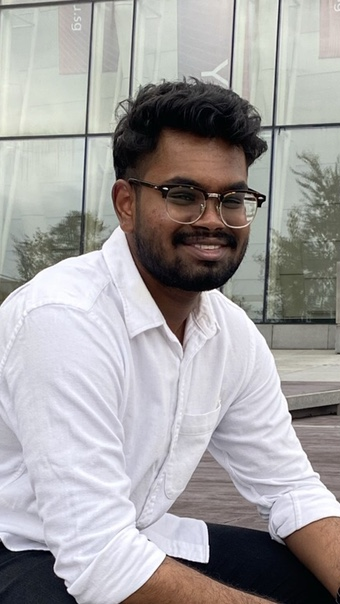
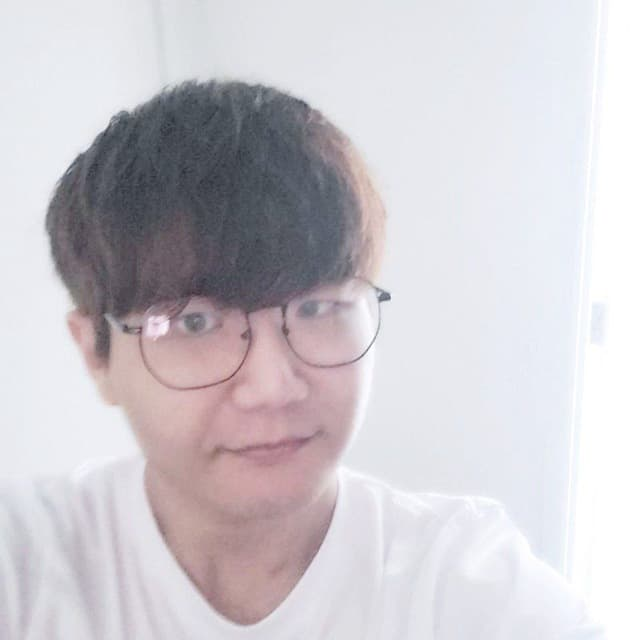

We are a team based in the [School of Computing, National University of Singapore](http://www.comp.nus.edu.sg).

You can reach us at the email `seer[at]comp.nus.edu.sg`

## Project team

### Kho Tze Jit

[[github](https://github.com/tzejit)]
[[portfolio](team/tzejit.md)]

* Role: Team lead
* Responsibilities: UI

### Lim Wan Ning

[[github](http://github.com/wanninglim)]
[[portfolio](team/wanninglim.md)]

* Role: Developer
* Responsibilities: UI

### Ngai Win Lynn

[[github](http://github.com/weenleen)]
[[portfolio](team/weenleen.md)]

* Role: Developer
* Responsibilities: UI

### Raveen Prabhu

[[github](http://github.com/itsraveen)]
[[portfolio](team/itsraveen.md)]

* Role: Developer
* Responsibilities: Looks after code quality, ensures adherence to coding standards, etc.

### Yim Jaewon

[[github](http://github.com/somekoreanboi)]
[[portfolio](team/johndoe.md)]

* Role: Developer
* Responsibilities: Ensure project deliverables are done on time and in the right format.
