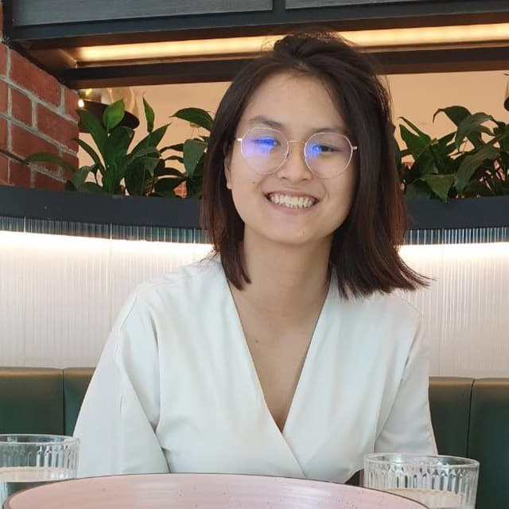
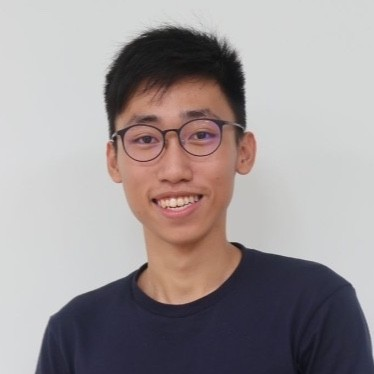
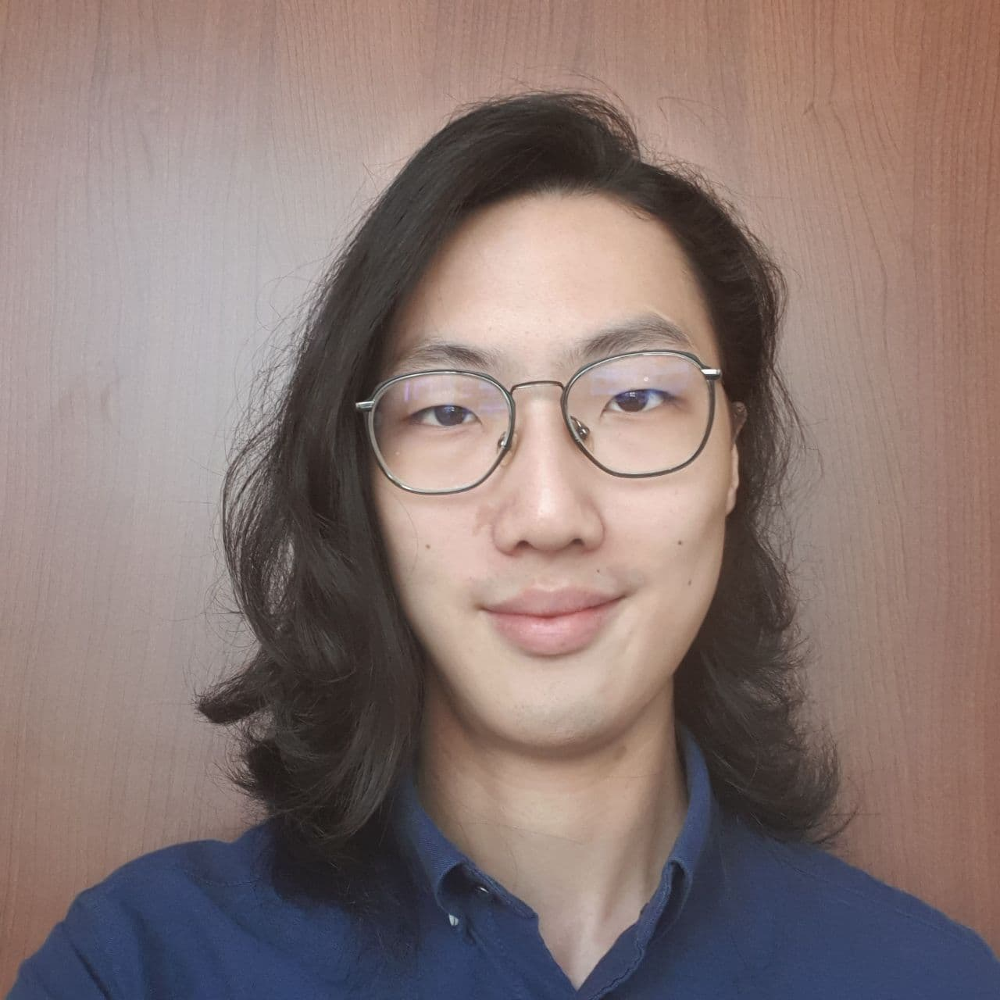
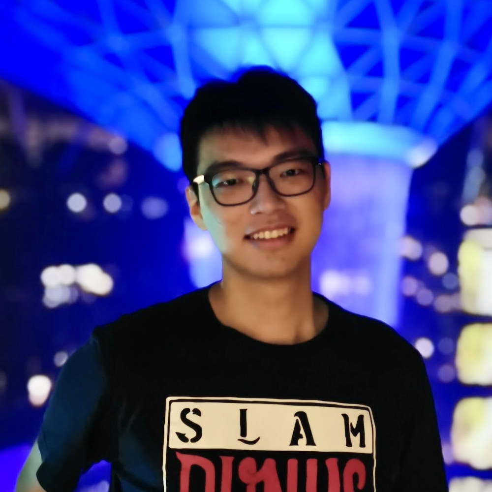

We are a team based in the [School of Computing, National University of Singapore](http://www.comp.nus.edu.sg).

You can reach us at the email `seer[at]comp.nus.edu.sg`

## Project team

### Chan Yu Cheng

[[github](https://github.com/yucheng11122017)]
[[portfolio](team/yucheng11122017.md)]

* Role: In charge of Model

### Lee Zhi Xuan

[[github](https://github.com/leezhixuan)]
[[portfolio](team/leezhixuan.md)]

* Role: In charge of Logic

### Justin Hoe

[[github](http://github.com/justinhoejj)]
[[portfolio](team/justinhoe.md)]

* Role: Developer
* Responsibilities: UI + Repo config

### Daniel Tan

[[github](http://github.com/cookiedan42)]
[[portfolio](team/daniel.md)]

* Role: Developer
* Responsibilities: tests and documentation

### Lim Ji Wei

[[portfolio](team/jiwei.md)]

* Role: Developer
* Responsibilities: In charge of Storage
