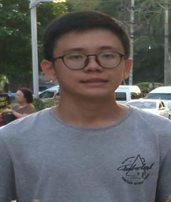
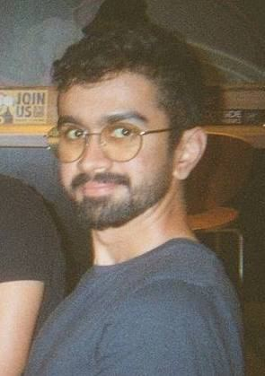
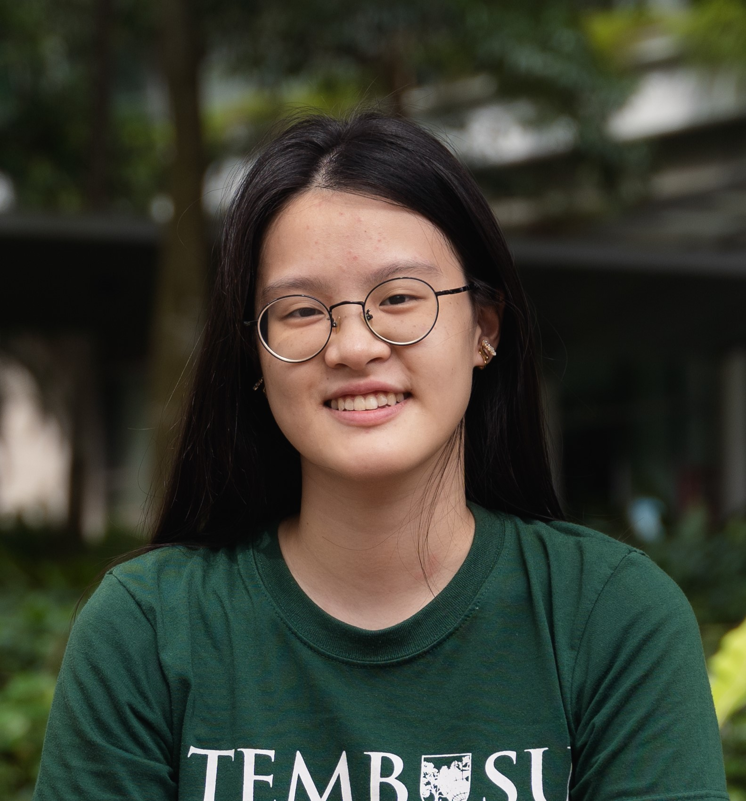
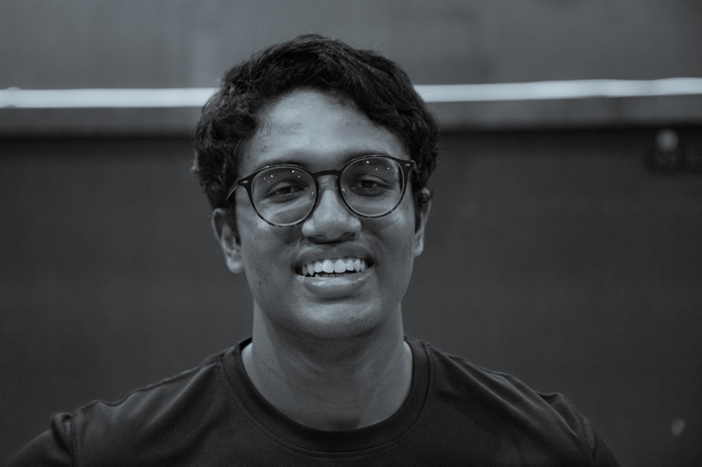

We are a team based in the [School of Computing, National University of Singapore](http://www.comp.nus.edu.sg).

You can reach us at the email `vishnu04@comp.nus.edu.sg`
(temporarily until team email is established)

## Project team

### Ngu Yi Yang

[[github](https://github.com/nguyiyang)]
[[portfolio](team/nguyiyang.md)]

* Role: Team Lead
* Responsibilities: Integration

### Rushil Ramesh

[[github](http://github.com/rushilramesh)]
[[portfolio](team/rushilramesh.md)]

* Role: Developer
* Responsibilities: Testing + Model

### Gabriel Waikin Loh Matienzo

[[github](http://github.com/GabrielWLM)]
[[portfolio](team/gabrielwlm.md)]

* Role: Developer
* Responsibilities: Documentation + Data

### Zhou Yirui

[[github](http://github.com/zhouyirui)]
[[portfolio](team/zhouyirui.md)]

* Role: Developer
* Responsibilities: Code Quality

### Vishnu Sundaresan

[[github](http://github.com/juliussneezer04)]
[[portfolio](team/vishnusundaresan.md)]

* Role: Developer
* Responsibilities: Deliverables + Scheduling & Tracking
