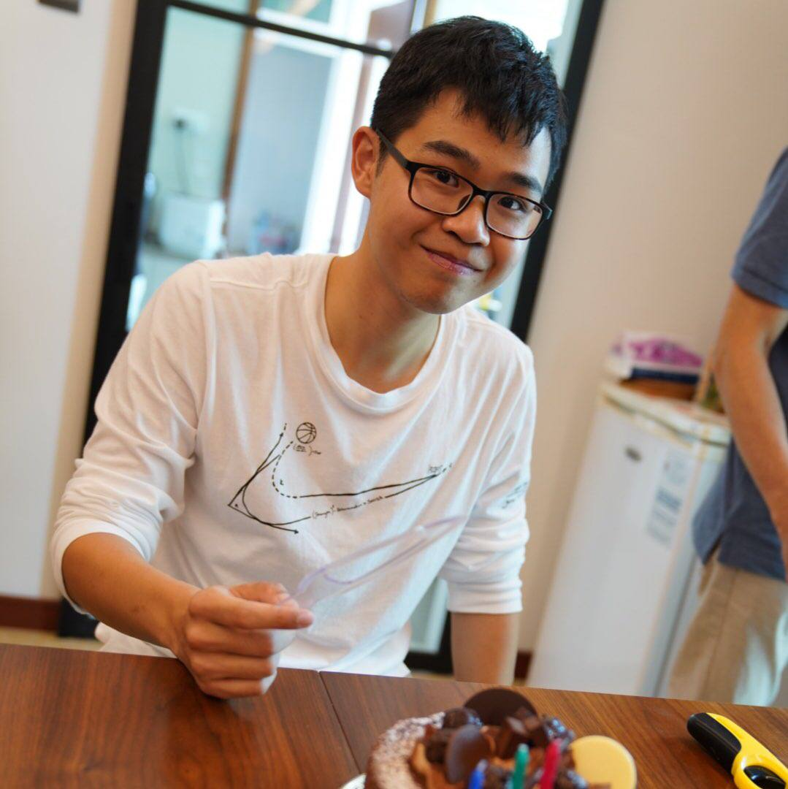
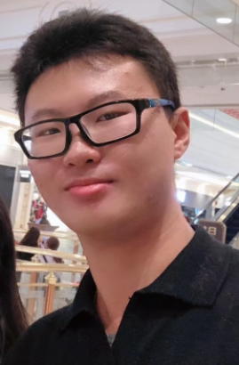
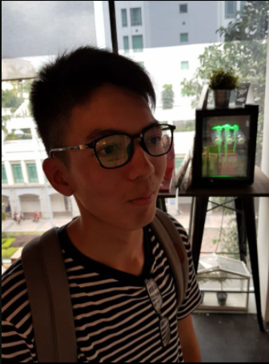

We are a team based in the [School of Computing, National University of Singapore](http://www.comp.nus.edu.sg).

You can reach us at the email `seer[at]comp.nus.edu.sg`

## Project team

### Lin Xingchen

[[github](http://github.com/Linxcathyyy)]
[[portfolio](team/linxcathyyy.md)]

* Role: Team Lead
* Responsibilities: UI

### Benjamin Lui

[[github](http://github.com/benluiwj)]
[[portfolio](team/benluiwj.md)]

* Role: Developer
* Responsibilities: Data

### Zhang Shi Chen

[[github](https://github.com/SkyBlaise99)]
[[portfolio](team/skyblaise99.md)]

* Role: Developer
* Responsibilities: Integration

### Naoki Shum

[[github](http://github.com/NaokiShum)]
[[portfolio](team/naokishum.md)]

* Role: Developer
* Responsibilities: Dev Ops + Threading

### Hongshu Wang

[[github](http://github.com/HongshuW)]
[[portfolio](team/hongshuw.md)]

* Role: Developer
* Responsibilities: Testing
