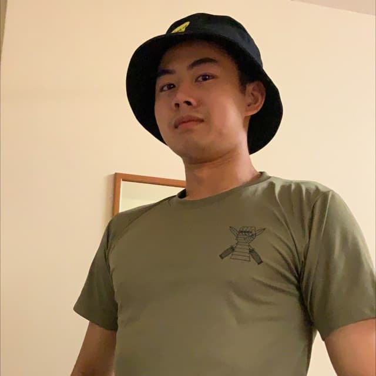
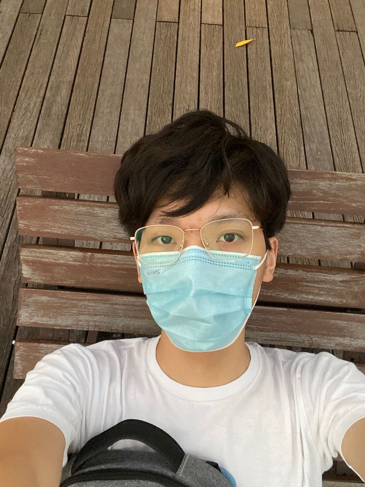
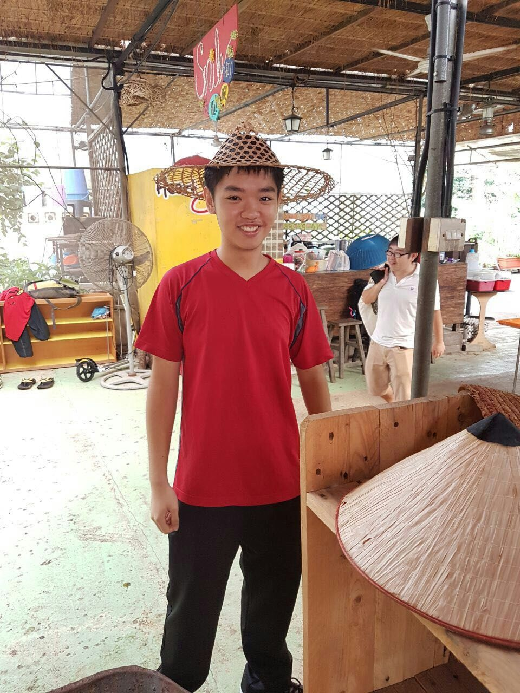

We are a team based in the [School of Computing, National University of Singapore](http://www.comp.nus.edu.sg).

You can reach us at the email `seer[at]comp.nus.edu.sg`

## Project team

### Bryan Wee Shun Yi

[[github](http://github.com/bryanwee023)]

* Role: Team Lead
* Responsibilities: UI, Scheduling and Tracking, Git Expert

### Hay Man Hnin Lwin

[[github](http://github.com/gracewang2322)]

* Role: Developer
* Responsibilities: Documentation, Deliverables and Deadlines

### Wang Pei

[[github](http://github.com/wangpeialex)]

* Role: Developer
* Responsibilities: Testing, Storage

### Bernardus Krishna

[[github](https://github.com/bernarduskrishna)]

* Role: Developer
* Responsibilities: Model, Logic
