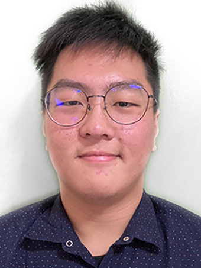
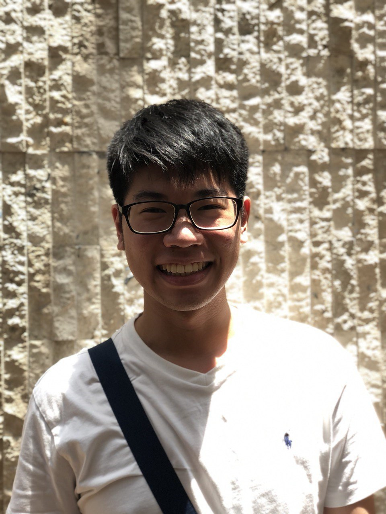
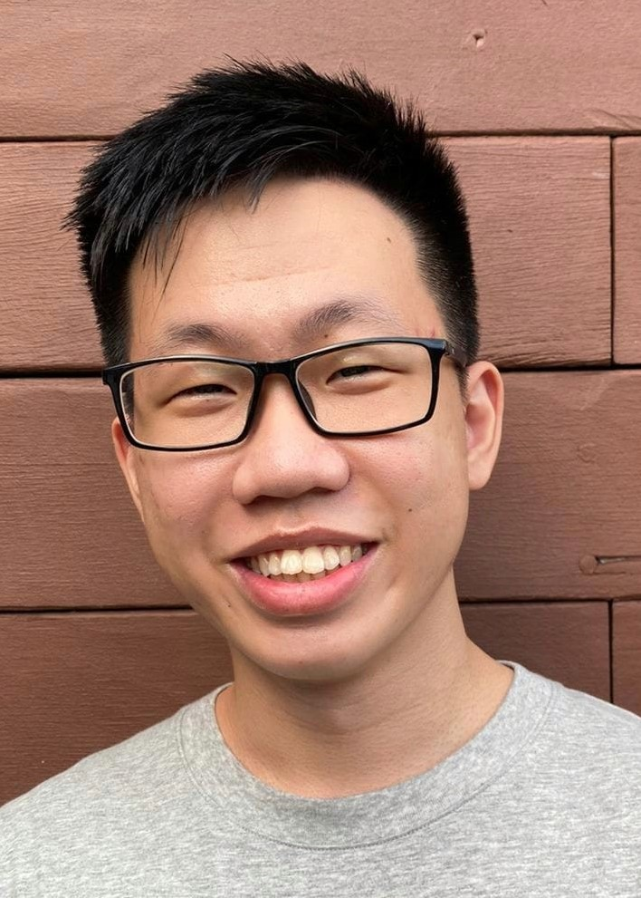
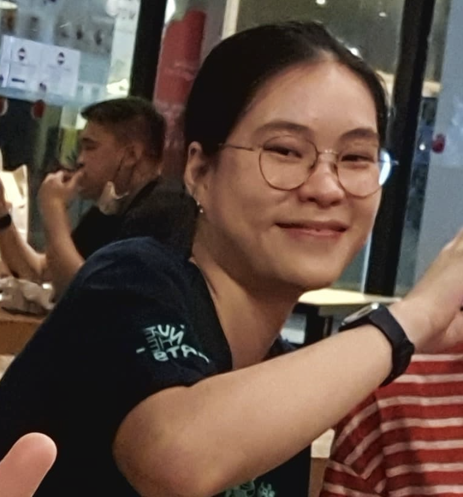

We are a team based in the [School of Computing, National University of Singapore](http://www.comp.nus.edu.sg).

You can reach us at the email `caikaian[at]comp.nus.edu.sg`

## Project team

### Cai <ins>Kaian</ins>

[[github](http://github.com/caipng)][[PPP](https://ay2122s1-cs2103-w14-3.github.io/tp/team/caipng.html)]

* Role: Integration, Deliverable and Deadlines
* Responsibilities: In charge of versioning of the code, maintaining the code repository, integrating various parts of
  the software to create a whole; Ensure project deliverables are done on time and in the right format

### Chai <ins>Wan Lin</ins>

[[github](http://github.com/chaiwanlin)][[PPP](https://ay2122s1-cs2103-w14-3.github.io/tp/team/chaiwanlin.html)]

* Role: Code Quality
* Responsibilities: Looks after code quality, ensures adherence to coding standards, etc.

### <ins>Marcus</ins> Choo Qi Jun

[[github](http://github.com/marcusc55)][[PPP](https://ay2122s1-cs2103-w14-3.github.io/tp/team/marcusc55.html)]

* Role: Documentation
* Responsibilities: Responsible for the quality of various project documents

### Mok Kheng Sheng <ins>Fergus</ins>

[[github](http://github.com/fergusmok)][[PPP](https://ay2122s1-cs2103-w14-3.github.io/tp/team/fergusmok.html)]

* Role: Team Lead, Scheduling and Tracking
* Responsibilities: Responsible for overall project coordination; In charge of defining, assigning, and tracking project
  tasks

### Ngo Ngoc Phuong <ins>Uyen</ins>

[[github](http://github.com/uyencfi)][[PPP](https://ay2122s1-cs2103-w14-3.github.io/tp/team/uyencfi.html)]

* Role: Testing
* Responsibilities: Ensures the testing of the project is done properly and on time
