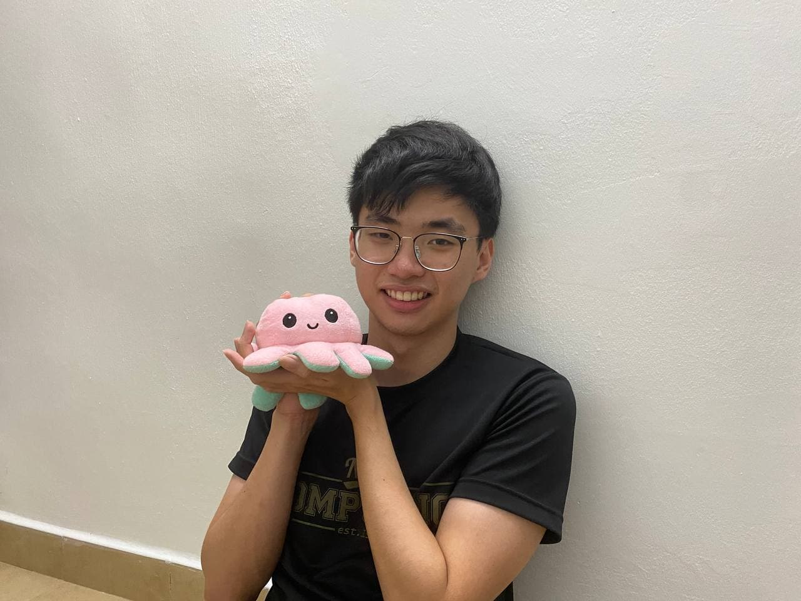
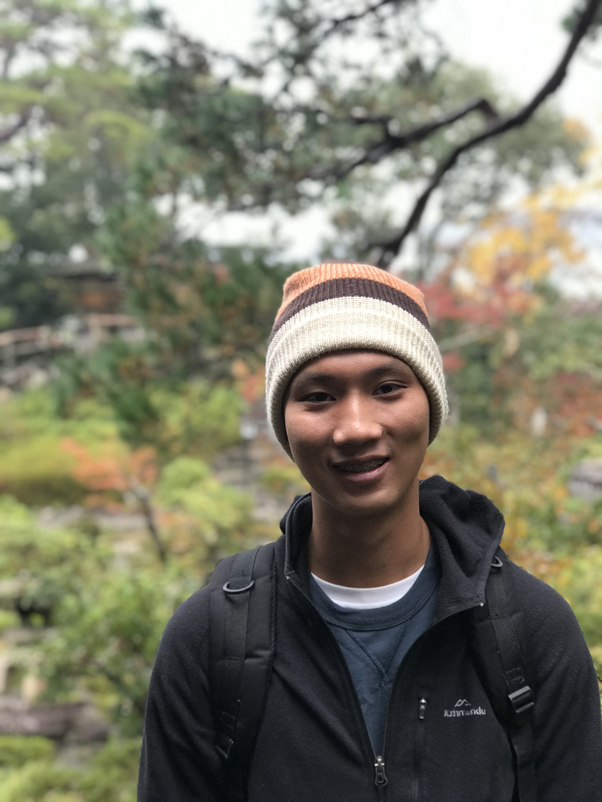
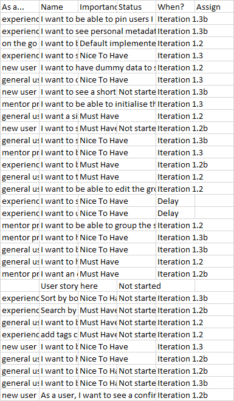

We are a team based in the [School of Computing, National University of Singapore](http://www.comp.nus.edu.sg).

## Project team

### Lee Yat Bun

[[github](http://github.com/yatbun)]

* Role: Team Lead
* Responsibilities: Logic IC

### Myron Neo

[[github](http://github.com/meerian) [[portfolio](team/meerian.md)]

* Role: Developer
* Responsibilities: Models IC

### Chan Zhuo Yang

[[github](http://github.com/zhuoyang125)]

* Role: Developer
* Responsibilities: UI IC

### Sherwin Poh Kai Xun

[[github](https://github.com/sherrpass)]

* Role: Developer
* Responsibilities: Storage IC
