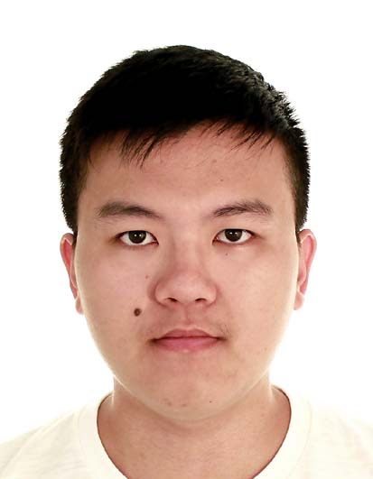
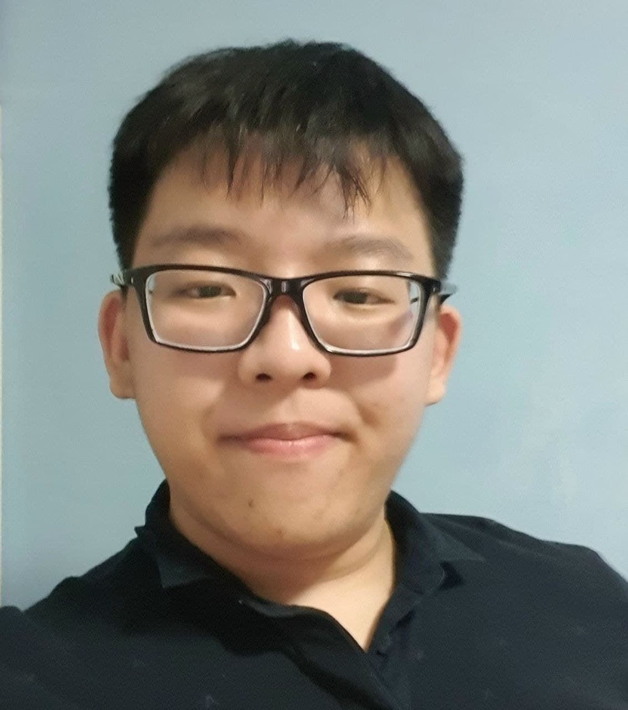
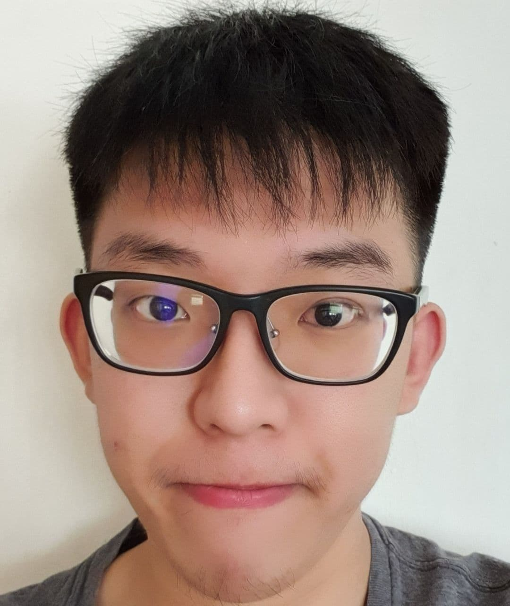

We are a team based in the [School of Computing, National University of Singapore](http://www.comp.nus.edu.sg).

You can reach us at the email `e0588244.nus.edu.sg`

## Project team

### Hannah Chia

[[github](https://github.com/kaixin-hc)]
[[portfolio](team/kaixin-hc.md)]

* Role: Team Lead, Developer
* Responsibilities: Project Management

### Xu Yukun

[[github](http://github.com/yukun99)]
[[portfolio](team/yukun99.md)]

* Role: Developer
* Responsibilities: Code Quality, Java + IntelliJ expert

### Elton Goh

[[github](http://github.com/eltongohjh)]
[[portfolio](team/eltongohjh.md)]

* Role: Developer
* Responsibilities: Documentation, Integration

### Elroy Goh

[[github](http://github.com/elroygohjy)]
[[portfolio](team/elroygohjy.md)]

* Role: Developer
* Responsibilities: Testing

### Jonathan Kwok

[[github](http://github.com/HalphasX)]
[[portfolio](team/halphasx.md)]

* Role: Developer
* Responsibilities: Deliverables, Integration

## Instructor

### Professor Damith C. Rajapakse

[[homepage](http://www.comp.nus.edu.sg/~damithch)]
[[github](https://github.com/damithc)]
