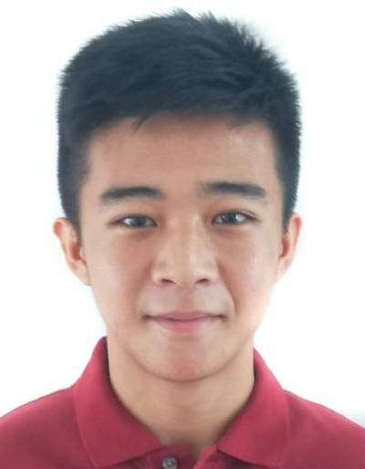
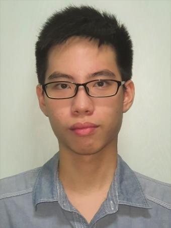
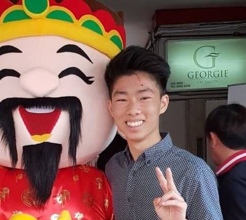
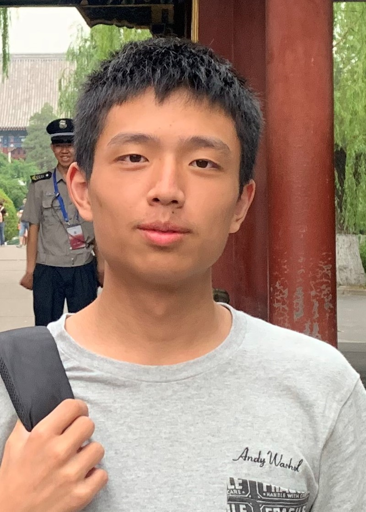

We are a team based in the [School of Computing, National University of Singapore](http://www.comp.nus.edu.sg).

You can reach us at the email `e0518538@u.nus.edu`

## Project team

### Lin Fangyuan

[[github](https://github.com/lmaoboxhack)]
[[portfolio](team/lmaoboxhack.md)]

* Role: Team Lead
* Responsibilities: Integration

### Tan Chin Han, Benjamin

[[github](http://github.com/BenjaminTan99)] [[portfolio](team/benjamintan99.md)]

* Role: Developer
* Responsibilities: Documentation, Deliverables & Deadlines

### Heng Chen Kai, Darren

[[github](http://github.com/darren2pro)] [[portfolio](team/darren2pro.md)]

* Role: Developer
* Responsibilities: Testing

### Gao Haochun

[[github](http://github.com/harry-gao-h)] [[portfolio](team/harry-gao-h.md)]

* Role: Developer
* Responsibilities: Code quality, Scheduling & Tracking
