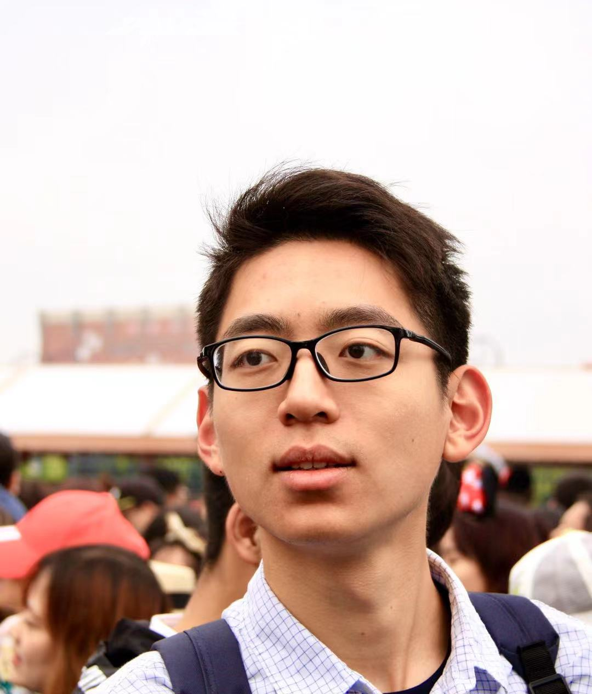
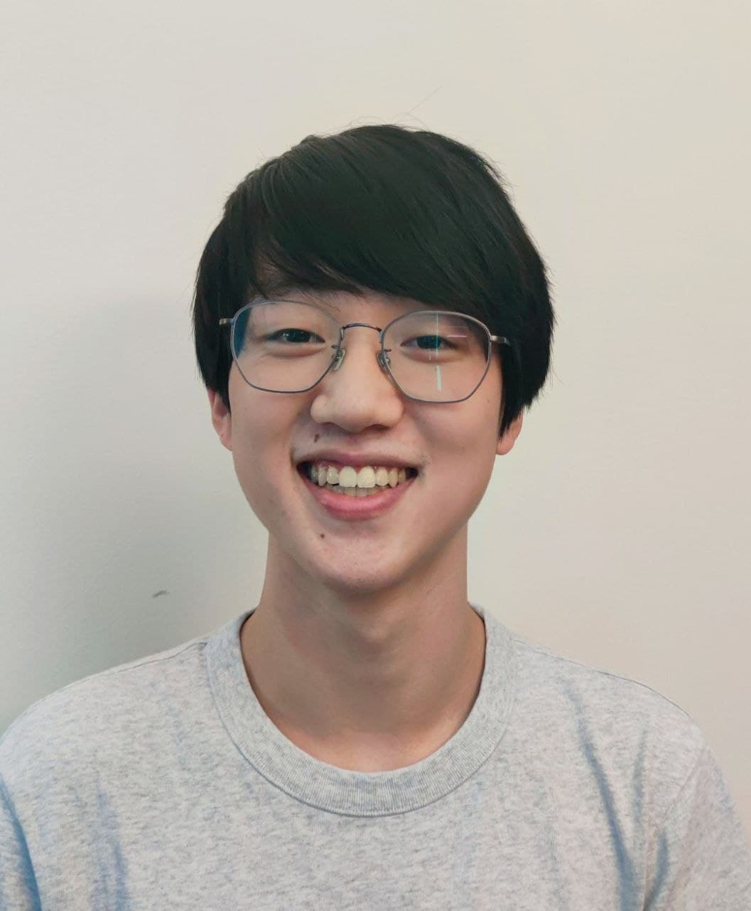
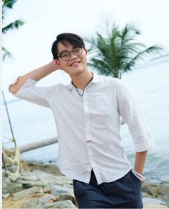
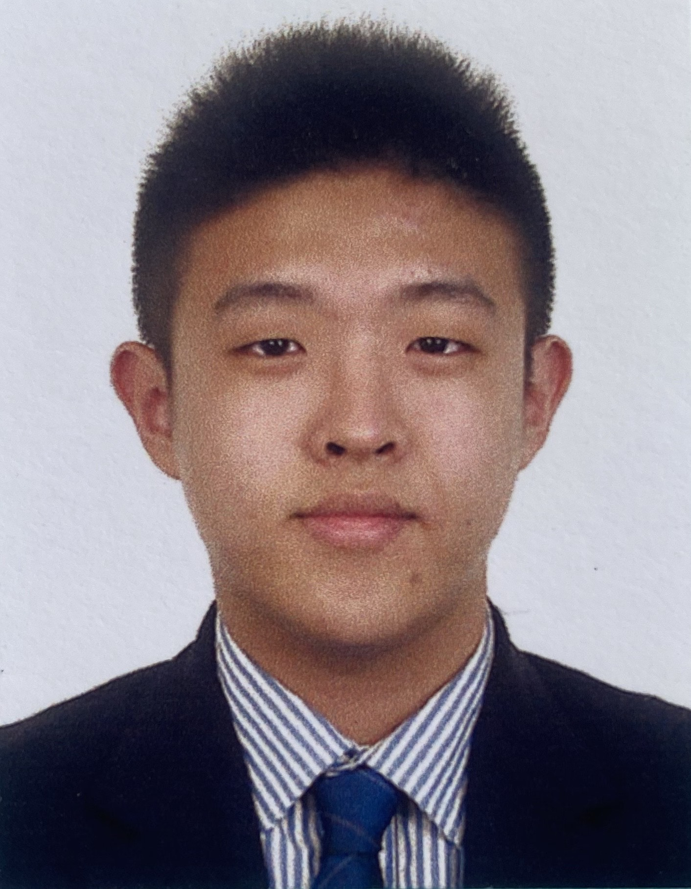

We are a team based in the [School of Computing, National University of Singapore](http://www.comp.nus.edu.sg).

## Project team

### Wang Mengzhe

[[github](http://github.com/charliemoweng)]
[[portfolio](team/charliemoweng.md)]

* Role: Developer
* Responsibilities: Task

### Wang Ruofan

[[github](http://github.com/ruofan1023)] [[portfolio](team/ruofan1023.md)]

* Role: Developer
* Responsibilities: UI, Module

### Joe Wel

[[github](http://github.com/tanjoewel)]
[[portfolio](team/joewel.md)]

* Role: Developer
* Responsibilities: Module

### Wang Guanlin (Joseph)

[[github](https://github.com/WangGLJoseph)]
[[portfolio](team/wangguanlinjoseph.md)]

* Role: Developer
* Responsibilities: Module

### Felissa Faustine

[[github](http://github.com/felissaf)]
[[portfolio](team/felissa.md)]

* Role: Developer
* Responsibilities: Module
