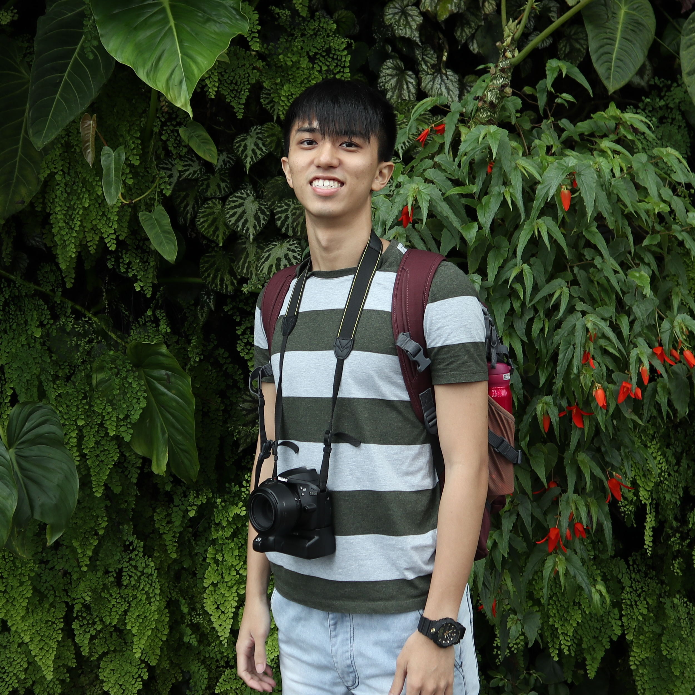
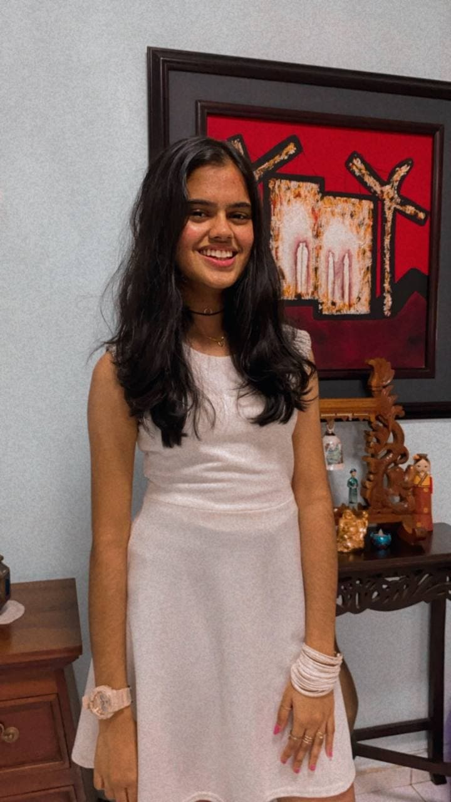
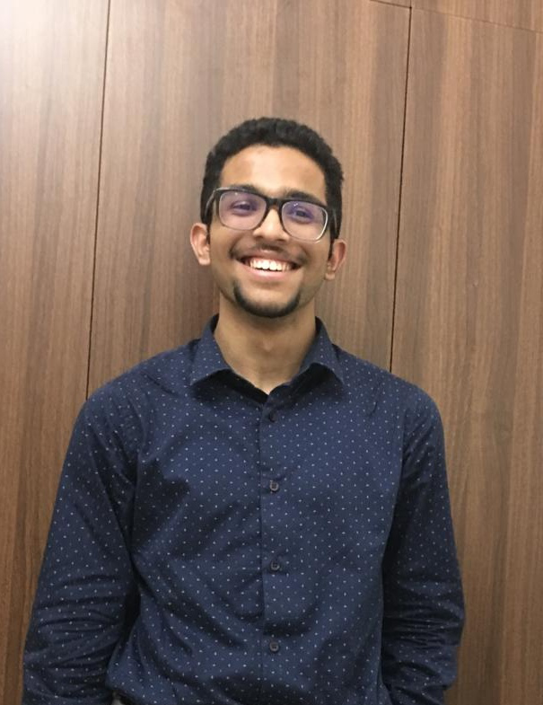
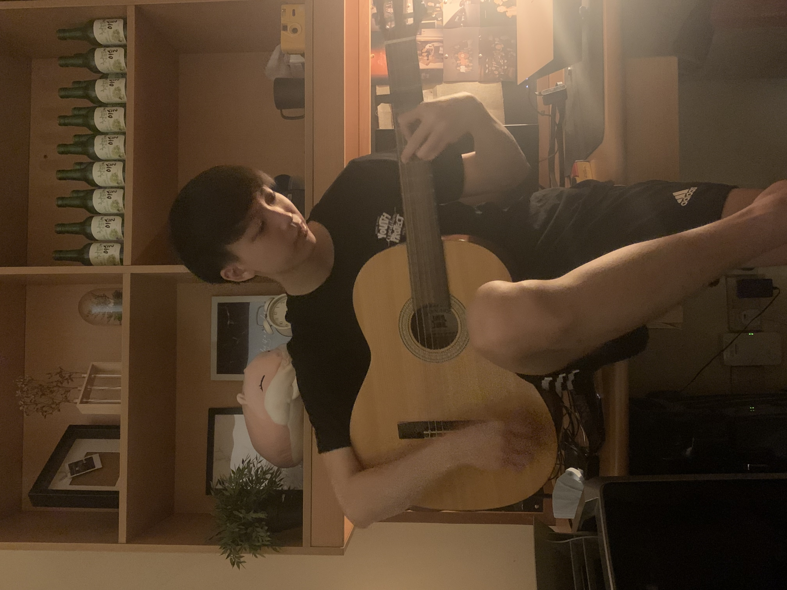

We are a team based in the [School of Computing, National University of Singapore](http://www.comp.nus.edu.sg).

You can reach us at our [github issues](https://github.com/AY2122S1-CS2103T-T10-1/tp/issues).

## Project team

### Adam Oh Zhi Hong

[[github](https://github.com/moreTriangles)]
[[portfolio](https://ay2122s1-cs2103t-t10-1.github.io/tp/team/moretriangles.html)]

[[PPP](team/moretriangles.md)]

* Role: Team Lead
* Responsibilities: Data & Storage

### Aishwarya Radhakrishnan Nair

[[github](http://github.com/aishh12)]
[[portfolio](https://ay2122s1-cs2103t-t10-1.github.io/tp/team/aishh12.html)]

[[PPP](team/aishh12.md)]

* Role: Code Quality
* Responsibilities: Commands

### Atin Sakkeer Hussain

[[github](http://github.com/crypto-code)]
[[portfolio](https://ay2122s1-cs2103t-t10-1.github.io/tp/team/crypto-code.html)]

[[PPP](team/crypto-code.md)]

* Role: Integration
* Responsibilities: AI Model and Commands

### Cheong Yee Ming

[[github](http://github.com/CheongYeeMing)]
[[portfolio](https://ay2122s1-cs2103t-t10-1.github.io/tp/team/cheongyeeming.html)]

[[PPP](team/cheongyeeming.md)]

* Role: Testing
* Responsibilities: Model

### Jai Lal Lulla

[[github](http://github.com/jai2501)]
[[portfolio](https://ay2122s1-cs2103t-t10-1.github.io/tp/team/jai2501.html)]

[[PPP](team/jai2501.md)]

* Role: Deliverables and Deadlines
* Responsibilities: UI
