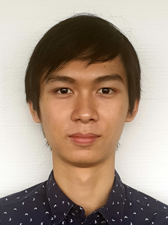
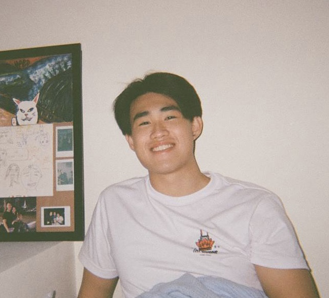

We are a team based in the [School of Computing, National University of Singapore](http://www.comp.nus.edu.sg).

## Project team

### Cheah Yan (Xie Yan)

[[github](https://github.com/CheahYan)]
[[portfolio](team/cheahyan.md)]

* Role: Developer
* Responsibilities: Documentation

### Joel Chan

[[github](https://github.com/JoelChanZhiYang/)]
[[portfolio](team/joelchanzhiyang.md)]

* Role: Team Lead
* Responsibilities: Deliverables and deadlines + Scheduling and Tracking

### Richard Li

[[github](http://github.com/rldefa)] [[portfolio](team/rldefa.md)]

* Role: Git Expert
* Responsibilities: Integration

### Chng Xian Lin

[[github](http://github.com/xianlinc)]
[[portfolio](team/xianlinc.md)]

* Role: Code Quality
* Responsibilities: Looks after code quality + Ensure adherence to coding standards + In charge of feature 'note'

### Gabriel Goh Kheng Lin

[[github](http://github.com/kawaiigabrielneko)]
[[portfolio](team/kawaiigabrielneko.md)]

* Role: Developer
* Responsibilities: Insurance + Glossary
