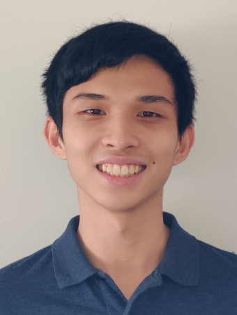
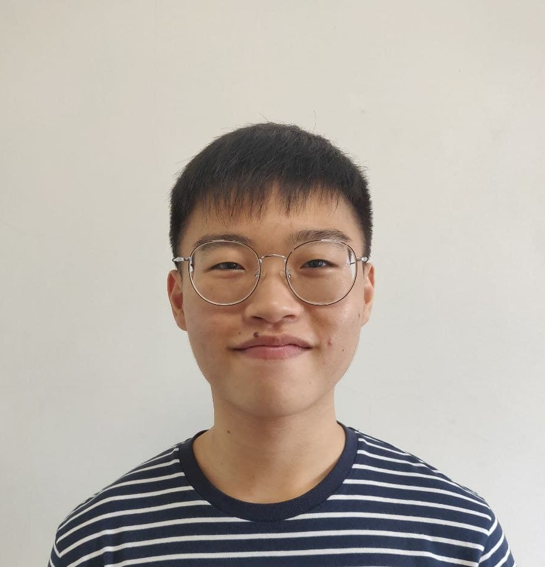
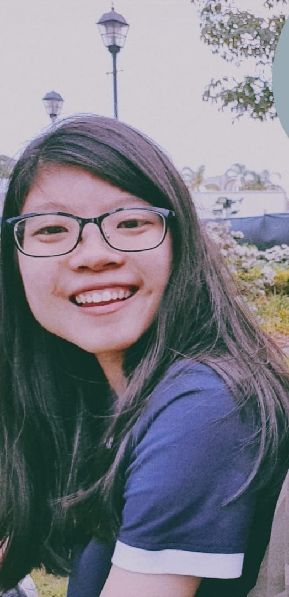
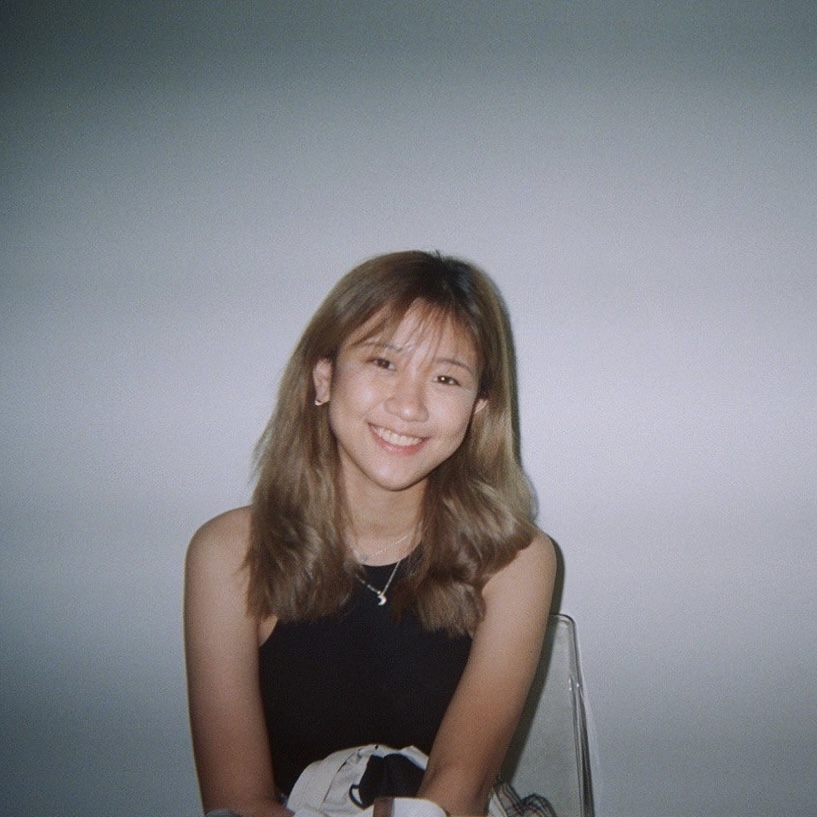

We are a team based in the [School of Computing, National University of Singapore](http://www.comp.nus.edu.sg).

You can reach us at the email `seer[at]comp.nus.edu.sg`

## Project team

### Shruthi

[[github](https://github.com/shruthi0310)]
[[portfolio](team/shruthi0310.md)]

* Role: Project Advisor

### Felix Ong

[[github](http://github.com/felix-ong)]
[[portfolio](team/felix-ong.md)]

* Role: Team Lead
* Responsibilities: UI

### Xing Wei

[[github](http://github.com/Moley456)]
[[portfolio](team/moley456.md)]

* Role: Developer
* Responsibilities: Data + Storage

### Seow Xiu Wen

[[github](http://github.com/YoYoCiti)]
[[portfolio](team/yoyociti.md)]

* Role: Developer
* Responsibilities: Dev Ops + Documentation

### Teo Sin Yee

[[github](http://github.com/tsinyee)]
[[portfolio](team/tsinyee.md)]

* Role: Developer
* Responsibilities: Model
