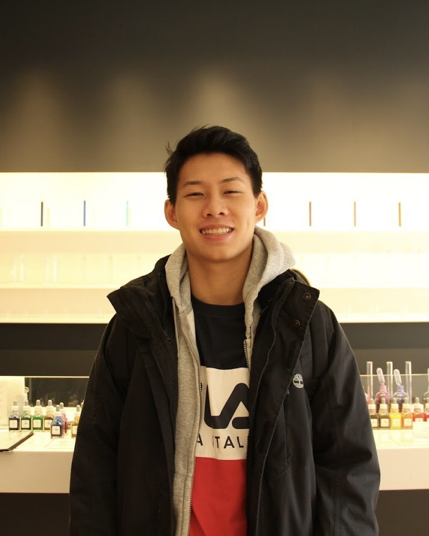
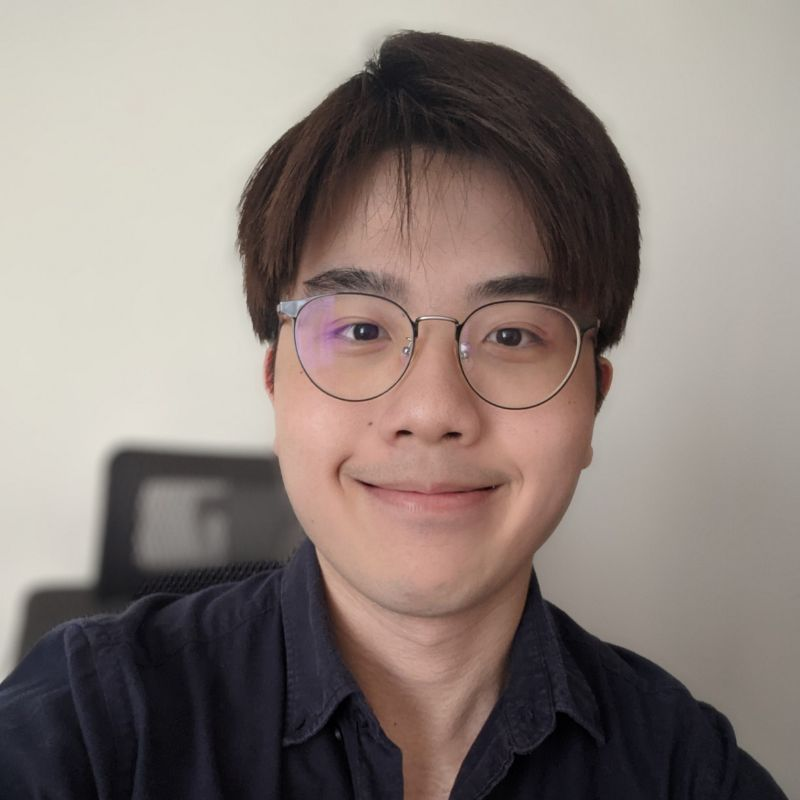
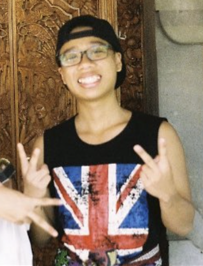

We are a team based in the [School of Computing, National University of Singapore](http://www.comp.nus.edu.sg).

You can reach us at the email `timothywongej@nus.edu.sg`

## Project team

### Timothy Wong

[[github](https://github.com/timothywongej)]
[[portfolio](team/timothywong.md)]

* Role: Team Lead
* Responsibilities: Documentation 

### Jason Ang

[[github](http://github.com/kdeasymoneysniper)]
[[portfolio](team/jasonang.md)]

* Role: Developer
* Responsibilities: UI and Integration

### Dion

[[github](http://github.com/noobmaster19)] [[portfolio](team/dion.md)]

* Role: Developer
* Responsibilities: Code quality

### Ang Yang Cheng

[[github](http://github.com/djiangel)]
[[portfolio](team/angyangcheng.md)]

* Role: Developer
* Responsibilities: Testing

### Shivam Tiwari

[[github](https://github.com/Shivlock221b)]
[[portfolio](team/shivlock221b.md)]

* Role: Developer
* Responsibilities: Deliverables and deadlines, scheduling and tracking
