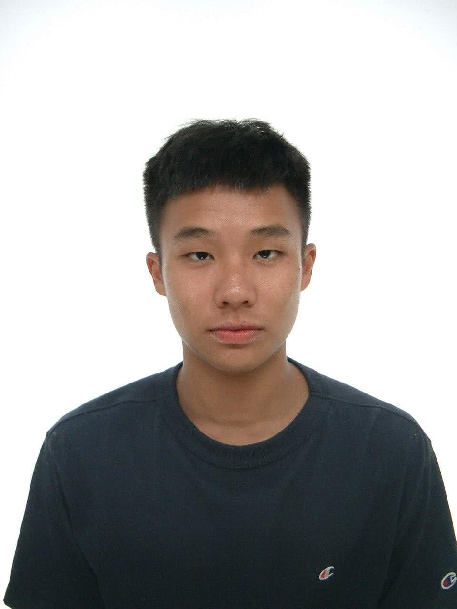
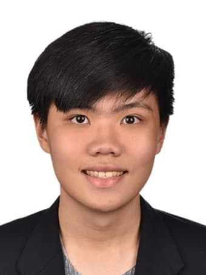
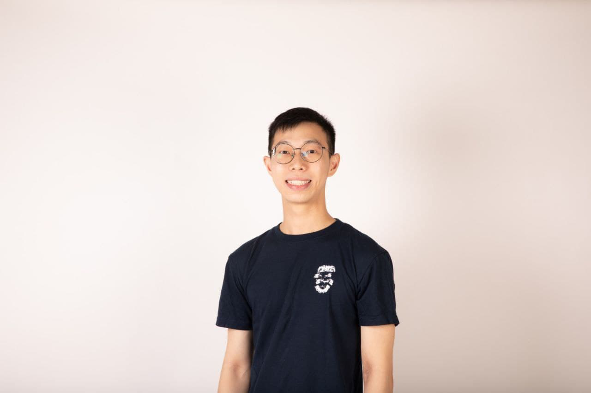
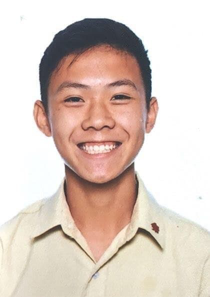

We are a team based in the [School of Computing, National University of Singapore](http://www.comp.nus.edu.sg).

## Project team

### Aakansha Narain

[[github](https://github.com/aakanshanarain)]

* Role: Developer
* Responsibilities: Delivarables
### Charlton Tan

[[github](http://github.com/charltonator)]

* Role: Developer
* Responsibilities: Testing

### Ethan Wong

[[github](http://github.com/ethanwong6362)]

* Role: Developer
* Responsibilities: Logic flow 

### Ng Jia Yuan

[[github](http://github.com/ngjiayuan)]

* Role: Team Lead
* Responsibilities: Code quality and team operations

### Zachary Lau

[[github](http://github.com/zacharylwy)]

* Role: Developer
* Responsibilities: UI
