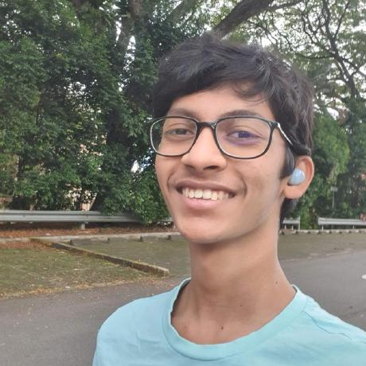
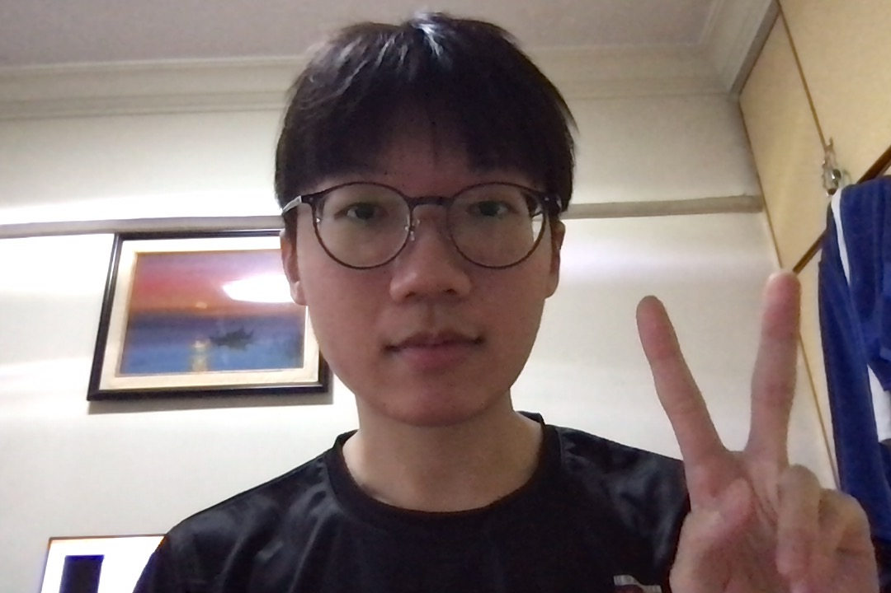
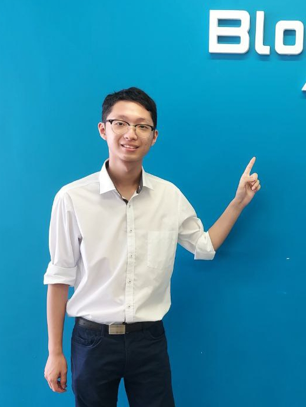
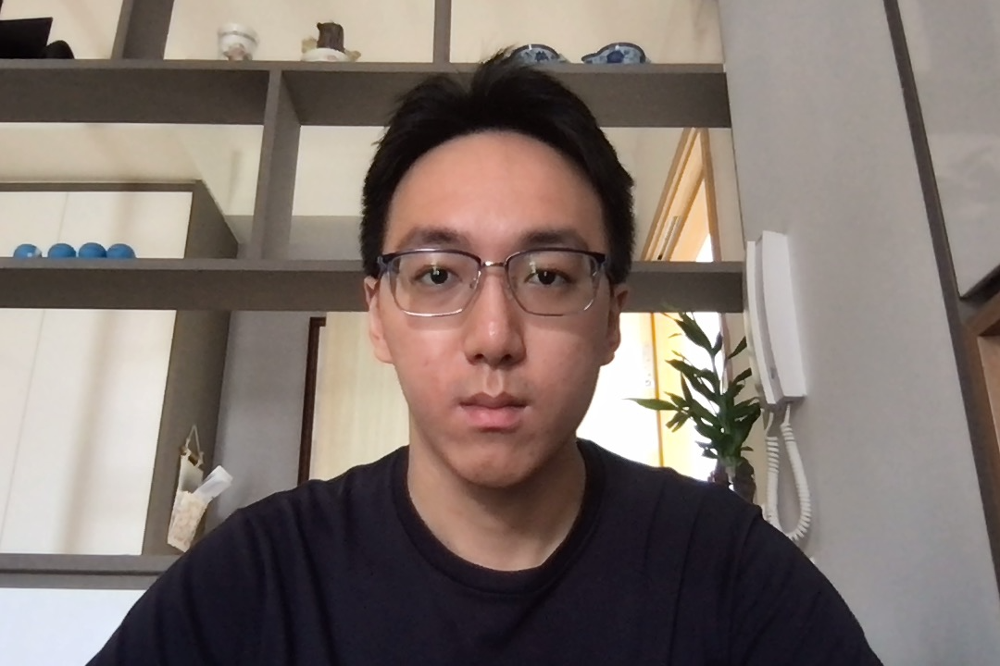
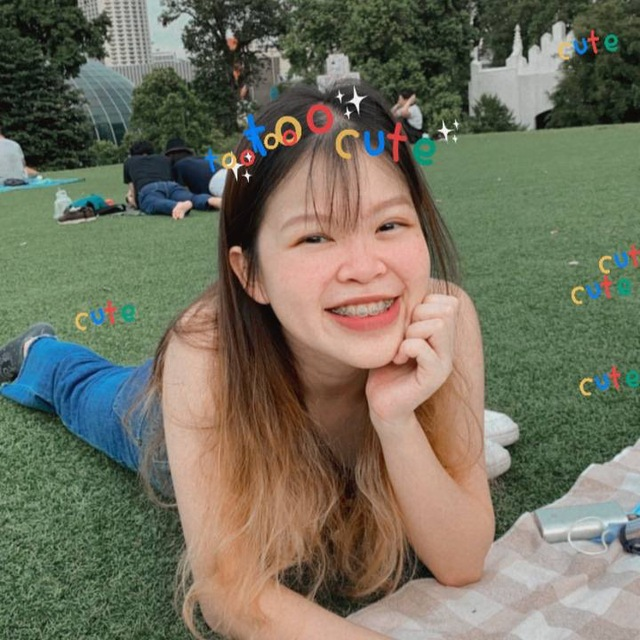

We are a team based in the [School of Computing, National University of Singapore](http://www.comp.nus.edu.sg).

## Project team

### Project advisor: [Prof. Damith Rajapakshe](http://www.comp.nus.edu.sg/~damithch)

### Vimuth Mendis

[[github](https://github.com/VimuthM)]
[[portfolio](team/vimuthm.md)]

* Role: Project Advisor

### Lim Hern Fong, Jared

[[github](http://github.com/jaredlhf)]
[[portfolio](team/jaredlhf.md)]

* Role: Developer

### Lim Zi Yang

[[github](https://github.com/gordonlzy)] [[portfolio](team/gordonlzy.md)]

* Role: Developer
* Responsibilities: Data

### Chong Jun Wei

[[github](http://github.com/chongjunwei)]
[[portfolio](team/chongjunwei.md)]

* Role: Developer
* Responsibilities: Dev Ops + Threading

### Rebecca Lau

[[github](http://github.com/rebeccalaujx)]
[[portfolio](team/rebeccalaujx.md)]

* Role: Developer
* Responsibilities: UI
