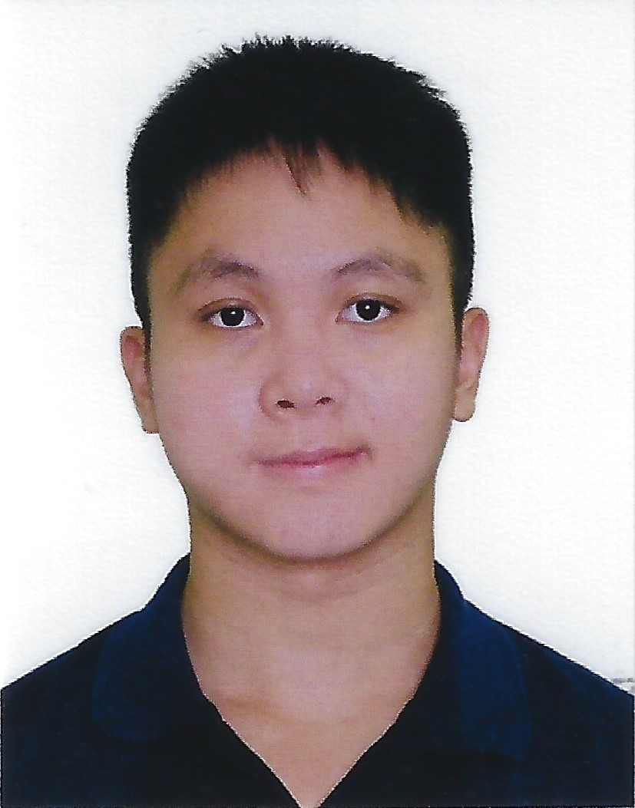
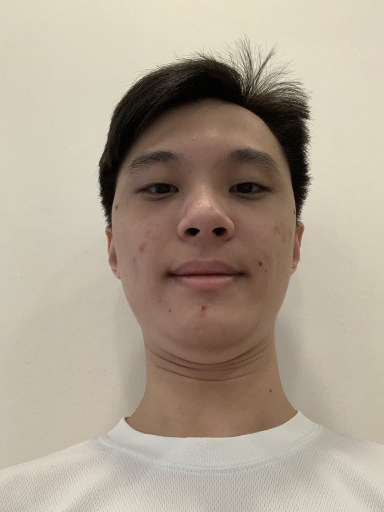
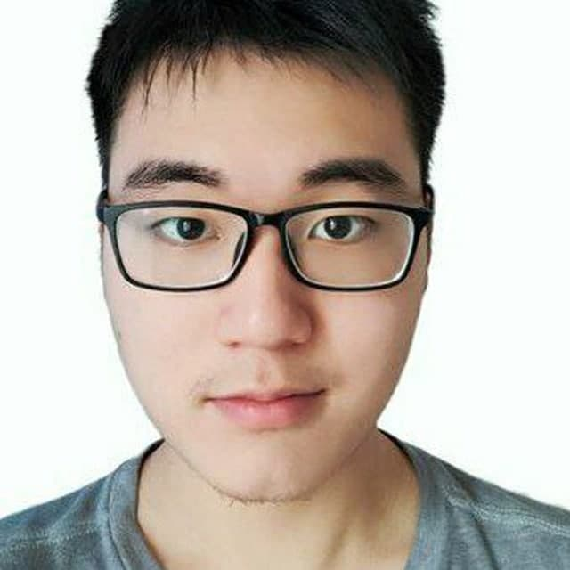
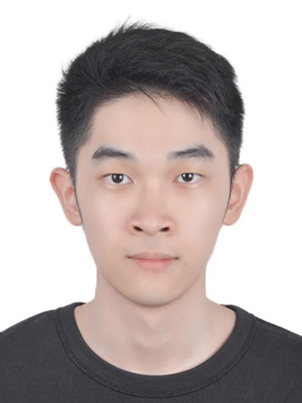

We are a team based in the [School of Computing, National University of Singapore](http://www.comp.nus.edu.sg).

# Project team

## Leeroy Liu

[[github](https://github.com/leeroy999)]
[[portfolio](team/leeroy999.md)]

* Role: Team Lead
* Responsibilities:
    * Responsible for overall project coordination.
    * Ensure deadlines are met

## Phua Guan Wei

[[github](http://github.com/gwphua)]
[[portfolio](team/gwphua.md)]

* Role: Developer
* Responsibilities:
    * Documentation
    * Code quality
    * GUI

## Samuel Lau Yi Ren

[[github](http://github.com/samuel-bit-prog)]
[[portfolio](team/samuel-bit-prog.md)]

* Role: Developer
* Responsibilities:
    * Intellij Expert
    * Git Expert
    * Program and component structure

## Chi Xu

[[github](http://github.com/tsiyuk)]
[[portfolio](team/tsiyuk.md)]

* Role: Developer
* Responsibilities:
    * Dev-ops & Continuous Integration

## Liu Zhilan

[[github](http://github.com/liuzhi1an)]
[[portfolio](team/liuzhi1an.md)]

* Role: Developer
* Responsibilities: testing
