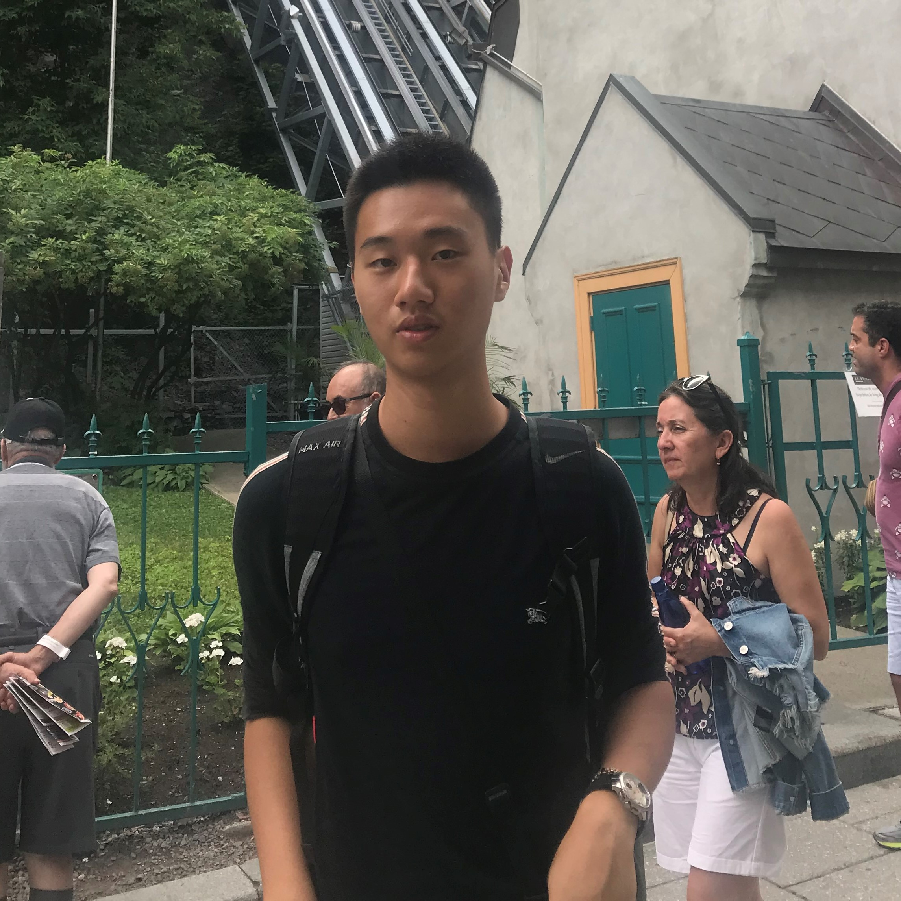

We are a team based in the [School of Computing, National University of Singapore](http://www.comp.nus.edu.sg).

You can reach us at the email `seer@comp.nus.edu.sg`

## Project team

### Yeh Yu-Cheng

[[github](https://github.com/eltonyeh)]
[[portfolio](team/eltonyeh.md)]

* Role: Developer
* Responsibilities: Unique Id for entities and task assignments.

### Tan Hua Kun

[[github](http://github.com/tanhuakun)]
[[portfolio](team/tanhuakun.md)]

* Role: Full Stack Developer
* Responsibilities: Creating Lesson, Exams and Viewing Panel logic.

### Srinivasan Neharikha

[[github](http://github.com/neha-5678)] [[portfolio](team/neha-5678.md)]

* Role: Developer
* Responsibilities: Storage for tasks and groups and creating logic for features related to Tasks.

### Le Quoc Huy

[[github](http://github.com/jeremy-7007)]
[[portfolio](team/jeremy-7007.md)]

* Role: Developer
* Responsibilities: Dev Ops + Threading

### Keerthi Vihashini

[[github](http://github.com/kvihashini)]
[[portfolio](team/kvihashini.md)]

* Role: Developer
* Responsibilities: UI
