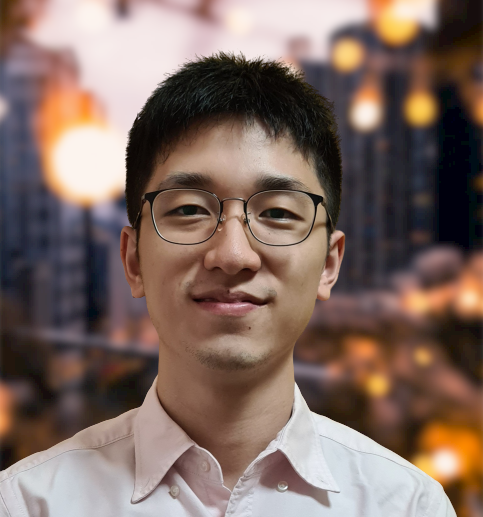
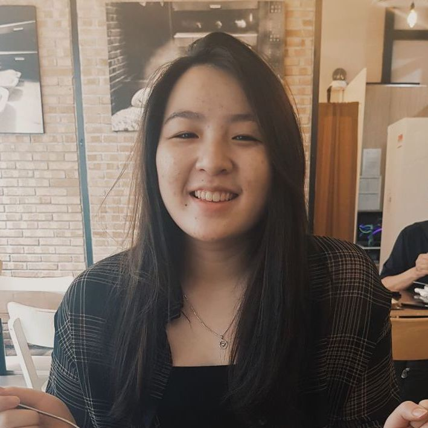

We are a team based in the [School of Computing, National University of Singapore](http://www.comp.nus.edu.sg).

You can reach us at the email `seer[at]comp.nus.edu.sg`

## Project team

### Ryan Tian Jun

[[github](https://github.com/ryantianj)]

[[portfolio](team/ryantianj.md)]

* Role: Team Lead
* Responsibilities: Commands, DG

### Marcus Chua

[[github](https://github.com/marcuschj)]

[[portfolio](team/marcuschj.md)]

* Role: Developer
* Responsibilities: Code quality, UI, DG, scheduling & tracking

### Ong Hong Kai

[[github](https://github.com/Imerbear)]

[[portfolio](team/imerbear.md)]

* Role: Developer
* Responsibilities:  Deliverables & Deadlines, Model, DG

### Natania Yovela Purwanto

[[github](http://github.com/nataniayp)]

[[portfolio](team/nataniayp.md)]

* Role: Developer
* Responsibilities: Testing, Parser, Scheduling & Tracking, README

### Lethicia Renissa Santoso

[[github](http://github.com/lethiciars)]

[[portfolio](team/lethiciars.md)]

* Role: Developer
* Responsibilities: Documentation, Storage, README
