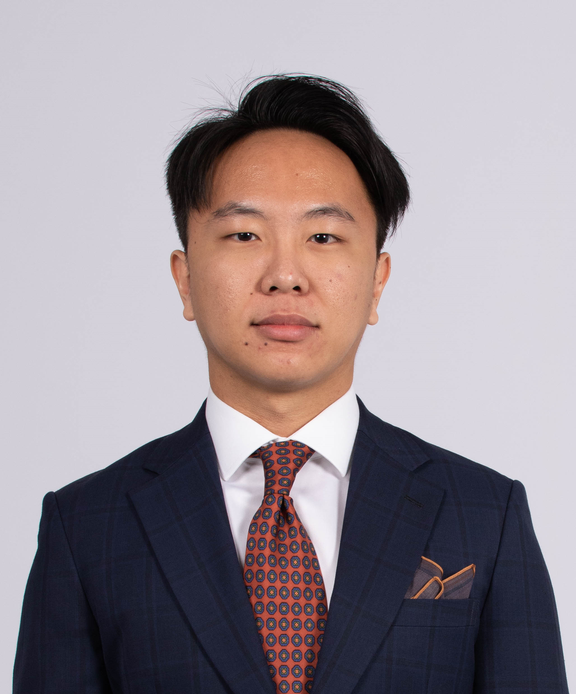

We are a team based in the [School of Computing, National University of Singapore](http://www.comp.nus.edu.sg).

## Project team

### Lee Yat Bun

[[github](http://github.com/yatbun)][[portfolio](team/yatbun.md)]

* Role: Team Lead
* Responsibilities: Logic IC

### Myron Neo

[[github](http://github.com/meerian)][[portfolio](team/meerian.md)]

* Role: Developer
* Responsibilities: Models IC

### Chan Zhuo Yang

[[github](http://github.com/zhuoyang125)][[portfolio](team/zhuoyang125.md)]

* Role: Developer
* Responsibilities: UI IC

### Sherwin Poh Kai Xun

[[github](https://github.com/sherrpass)][[portfolio](team/sherwinpoh.md)]

* Role: Developer
* Responsibilities: Storage IC
