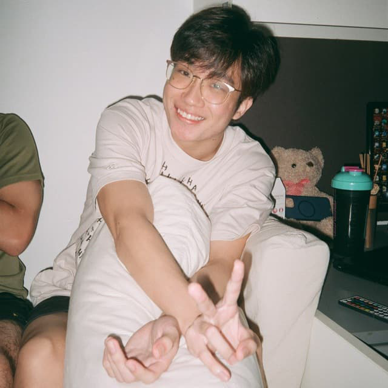

We are a team based in the [School of Computing, National University of Singapore](http://www.comp.nus.edu.sg).

You can reach us at the email `seer[at]comp.nus.edu.sg`

## Project team

### Timothy Wong

[[github](https://github.com/timothywongej)]
[[portfolio](team/timothywong.md)]

* Role: Project Advisor

### Jason Ang

[[github](http://github.com/kdeasymoneysniper)]
[[portfolio](team/jasonang.md)]

* Role: Team Lead
* Responsibilities: UI

### Dion

[[github](http://github.com/noobmaster19)] [[portfolio](team/noobmaster.md)]

* Role: Developer
* Responsibilities: Data Master

### Ang Yang Cheng

[[github](http://github.com/djiangel)]
[[portfolio](team/angyangcheng.md)]

* Role: Developer
* Responsibilities: Dev Ops + Threading

### Shivam Tiwari

[[github](https://github.com/Shivlock221b)]
[[portfolio](team/johndoe.md)]

* Role: Developer
* Responsibilities: UI
