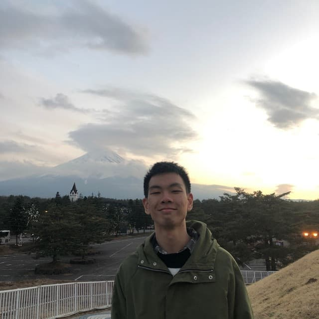
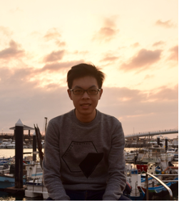

We are a team based in the [School of Computing, National University of Singapore](http://www.comp.nus.edu.sg).

You can reach us at the email `seer[at]comp.nus.edu.sg`

## Project team

### Jason

[[github](https://github.com/jason-ng-zq99)]
[[portfolio](team/johndoe.md)]

* Role: Team Lead
* Responsibilities: In charge of Common

### Germaine

[[github](https://github.com/driip-ddrop)]
[[portfolio](team/johndoe.md)]

* Role: Developer
* Responsibilities: Documentation + In charge of Storage

### Zhi Bin

[[github](https://github.com/czhi-bin)]
[[portfolio](team/johndoe.md)]

* Role: Developer
* Responsibilities: Deliverables and deadlines + In charge of Logic 

### James

[[github](https://github.com/James-Kua)]
[[portfolio](team/johndoe.md)]

* Role: Developer
* Responsibilities: Code Quality + Testing + In charge of UI

### Rui Quan

[[github](https://github.com/tanruiquan)]
[[portfolio](team/johndoe.md)]

* Role: Developer
* Responsibilities: Integration + In charge of Model
