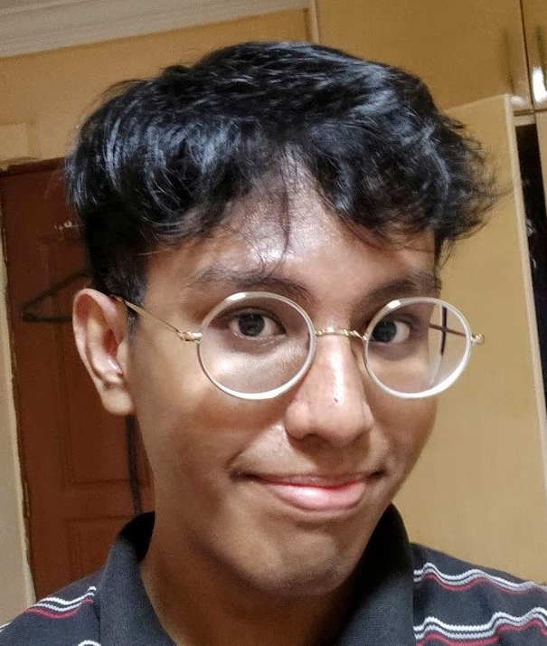

We are a team based in the [School of Computing, National University of Singapore](http://www.comp.nus.edu.sg).

You can reach us at the email `seer[at]comp.nus.edu.sg`

## Project team

### Zen

[[github](https://github.com/Zenlzb)][[portfolio](team/zenlzb.md)]

* Role: Team Lead, Integration
* Responsibilities: Logic

### Hanif

[[github](http://github.com/hanif-kamal)][[portfolio](team/hanif-kamal.md)]

* Role: Documentation, Code Quality
* Responsibilities: Model

### Joshua

[[github](http://github.com/jyrw)][[portfolio](team/jyrw.md)]

* Role: Documentation, Code Quality
* Responsibilities: Storage

### Aaron

[[github](http://github.com/e0543860)][[portfolio](team/aaronloh.md)]

* Role: Deliverables and deadlines, Scheduling and tracking
* Responsibilities: UI

### Myat

[[github](http://github.com/NUSmhk)][[portfolio](team/nusmhk.md)]

* Role: Testing
* Responsibilities: Testing
