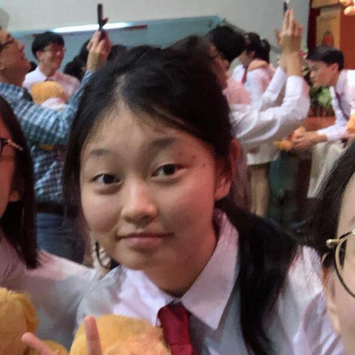

We are a team based in the [School of Computing, National University of Singapore](http://www.comp.nus.edu.sg).

You can reach us at the email `AniList@nus.edu.sg`

## Project team

### Cui Langyuan

[[github](https://github.com/clyveycui)]
[[portfolio](team/clyveycui.md)]

* Role: Team Lead
* Responsibilities: Overall project coordination

### Chua Min Hong

[[github](https://github.com/auhc99)]
[[portfolio](team/auhc99.md)]

* Role: Code Quality
* Responsibilities: Looks after code quality, ensures adherence to coding standards

### Ryan Chung Yi Sheng

[[github](https://github.com/NekrozQliphort)] [[portfolio](team/NekrozQliphort.md)]

* Role: Documentation
* Responsibilities: Ensuring quality of various project documents

### Luo Dan

[[github](http://github.com/luodan01)]
[[portfolio](team/luodan01.md)]

* Role: Integration
* Responsibilities: Versioning the code, maintaining the code repository

### Muhammad Faruq

[[github](http://github.com/muhammad-faruq)]
[[portfolio](team/muhammad-faruq.md)]

* Role: Scheduling and UI manager
* Responsibilities: Defining, assigning, tracking project tasks. Managing UI matters.
