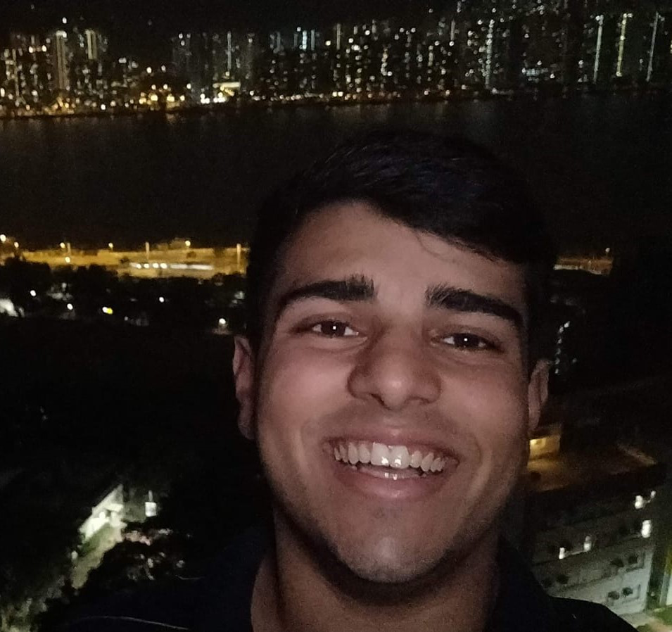

We are a team based in the [School of Computing, National University of Singapore](http://www.comp.nus.edu.sg).

You can reach us at the email `seer[at]comp.nus.edu.sg`

## Project team

### Rachel Cheah

[[github](http://github.com/RachelCheah)]

* Role: Team Lead
* Responsibilities: Scheduling and tracking project progress

### Ong Cheng Seong

[[github](https://github.com/chengseong)]

* Role: Developer
* Responsiblities : Integration and Code Quality

### Jin Mei Xuan

[[github](http://github.com/meixuanjin)]

* Role: Developer
* Responsibilities: Deliverables and Deadlines

### Siddharth Srivastava

[[github](https://github.com/siddharth-sid)]

* Role: Developer
* Responsibilities: Testing

### Chua Kai Jun

[[github](http://github.com/nujiak)]

* Role: Developer
* Responsibilities: Documentation
