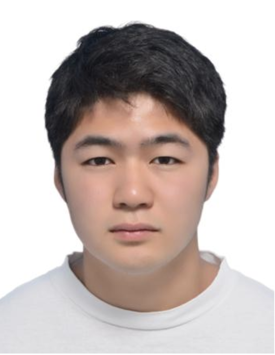

We are a team based in the [School of Computing, National University of Singapore](http://www.comp.nus.edu.sg).

You can reach us at the team lead (Shawn)'s email `e0311246@u.nus.edu`  
Here is our module coordinator's [homepage](https://www.comp.nus.edu.sg/~damithch/).

## Project team

### Shawn Lim

[[github](https://github.com/lwlshawn)]
[[portfolio](team/lwlshawn.md)]

* Role: Team Lead
* Responsibilities: Documentation, Integration

### Ng Chi Sern

[[github](https://github.com/ngchisern)]
[[portfolio](team/ngchisern.md)]

* Role: Developer
* Responsibilities: Integration

### Yuichiro Fukushima

[[github](https://github.com/yuifuku1118)] [[portfolio](team/yuichiro.md)]

* Role: Developer
* Responsibilities: Deliverables and deadlines, Scheduling and tracking

### Gnoh Cheng Yi

[[github](http://github.com/gnohchengyi)] [[portfolio](team/gnohchengyi.md)]

* Role: Developer
* Responsibilities: Code quality, JavaFX expert

### Tanishq Sharma

[[github](https://github.com/Tanishq4331)]
[[portfolio](team/tanishq.md)]

* Role: Developer
* Responsibilities: Testing
